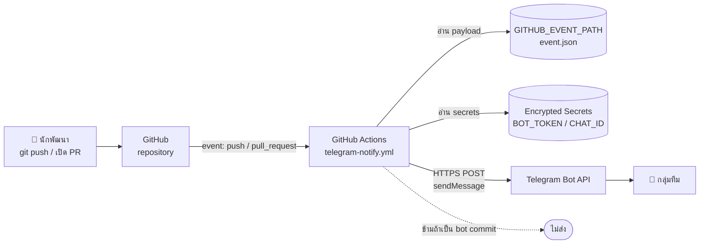

# 🤖 สถาปัตยกรรม: บอทแจ้งเตือน Commit เข้า Telegram

> เอกสารออกแบบระบบ "แจ้งเตือนทีมเมื่อมีคน push งานขึ้น GitHub"
> เขียนแบบพกพา — ยกไปใช้กับโปรเจกต์อื่น (เช่น **Sentiara**) ได้ทันที
> อ้างอิงจากระบบที่ใช้งานจริงใน `domexxzz/ProjectJhob`

---

## 1. ปัญหาที่ระบบนี้แก้

ทีมหลายคนทำงานพร้อมกัน แล้วเกิดปัญหาซ้ำ ๆ:

| ปัญหา | ผลที่ตามมา |
|---|---|
| ไม่รู้ว่าเพื่อนส่งงานขึ้นมาแล้ว | ทำงานทับกัน / merge conflict |
| ไม่รู้ว่าใครแตะ branch production | โค้ดพังขึ้น live โดยไม่มีใครรู้ |
| ต้องเปิด GitHub เช็กเอง | ไม่มีใครเช็ก → รู้ตัวช้า |

**เป้าหมาย:** ทุกครั้งที่มีความเคลื่อนไหวใน repo → เด้งเข้าแชทที่ทีมอยู่กันอยู่แล้ว (Telegram) ภายในไม่กี่วินาที

---

## 2. ภาพรวมสถาปัตยกรรม



**หลักการ:** ใช้ CI ที่มีอยู่แล้วเป็นตัวกลาง — ไม่ต้องมี server, ไม่ต้องเปิด port, ไม่ต้องพึ่ง third-party service

---

## 3. องค์ประกอบ

| ส่วน | หน้าที่ | หมายเหตุ |
|---|---|---|
| **GitHub Actions workflow** | ดัก event → ประกอบข้อความ → ยิง API | ไฟล์เดียวจบ ไม่มี dependency |
| **Telegram Bot** | ตัวส่งข้อความ | สร้างฟรีผ่าน @BotFather |
| **Repository Secrets** | เก็บ token/chat id แบบเข้ารหัส | ไม่อยู่ในโค้ด ไม่โผล่ใน log |
| **Event payload** | ข้อมูล commit/PR ดิบ | อ่านจาก `$GITHUB_EVENT_PATH` ด้วย `jq` |

### ทำไมเลือกทางนี้

| ทางเลือก | ข้อดี | ข้อเสีย | สรุป |
|---|---|---|---|
| **GitHub Actions → Telegram API** | ฟรี, คุมข้อความได้ 100%, ไม่มี infra | ต้องเขียน workflow เอง | ✅ **เลือกอันนี้** |
| GitHub Webhook → server ตัวเอง | ยืดหยุ่นสุด | ต้องมี server 24 ชม. + endpoint สาธารณะ | ❌ เกินจำเป็น |
| Zapier / IFTTT | ตั้งง่าย | เสียเงิน, ข้อความปรับไม่ได้, ข้อมูลผ่านบุคคลที่สาม | ❌ |
| บอทสำเร็จรูปใน Telegram | ติดตั้งเร็ว | ต้องให้สิทธิ์เข้าถึง repo, ข้อความเป็นอังกฤษตายตัว | ❌ |

---

## 4. Data flow (ทีละขั้น)

```
1. นักพัฒนา push
2. GitHub ยิง event เข้า Actions พร้อม payload (commits[], pusher, compare url)
3. Workflow เช็กเงื่อนไขข้าม (actor เป็นบอท? ไม่มี commit?)
4. อ่าน secrets → ถ้าไม่มี ข้ามเงียบ ๆ (ไม่ทำให้ CI แดง)
5. jq ดึงข้อมูลจาก payload → ประกอบข้อความภาษาไทย
6. curl POST → https://api.telegram.org/bot<TOKEN>/sendMessage
7. ข้อความเด้งในกลุ่ม
```

### ข้อมูลที่ดึงจาก payload

| ต้องการ | แหล่ง |
|---|---|
| ใคร push | `github.actor` |
| branch | `github.ref_name` |
| จำนวน commit | `jq '.commits \| length'` |
| ข้อความ commit | `jq -r '.commits[:10][] \| .message \| split("\n")[0]'` |
| ลิงก์ดู diff | `github.event.compare` |
| ข้อมูล PR | `github.event.pull_request.*` |

---

## 5. Design decisions (เหตุผลที่สำคัญ)

### 5.1 ข้าม commit ของบอท
```yaml
if: github.actor != 'github-actions[bot]'
```
**ทำไม:** ถ้า repo มี CI ที่ commit กลับเอง (เช่น auto-build artifact) กลุ่มจะโดนสแปมทุกรอบ
**ปรับสำหรับ Sentiara:** ถ้ามีบอทตัวอื่น เพิ่มเงื่อนไข เช่น `&& github.actor != 'dependabot[bot]'`

### 5.2 ส่งแบบ plain text ไม่ใช้ parse_mode
**ทำไม:** ข้อความ commit มี `_ * [ ] ( ) ~ \`` ได้อิสระ ถ้าใช้ Markdown/HTML แล้วไม่ escape → Telegram ตอบ 400 และข้อความหาย
**ผลข้างเคียงที่ยอมรับได้:** ไม่มีตัวหนา/ลิงก์ฝัง — แต่ Telegram auto-link URL ให้อยู่แล้ว

### 5.3 ไม่มี secret → ข้ามเงียบ ๆ (exit 0)
```bash
if [ -z "$TOKEN" ] || [ -z "$CHAT_ID" ]; then exit 0; fi
```
**ทำไม:** คน fork repo หรือ clone ไปใช้จะไม่มี secret — ไม่ควรทำให้ CI แดงจนคนชินแล้วมองข้าม error จริง

### 5.4 จำกัด 10 commit
**ทำไม:** push ใหญ่ ๆ (merge branch เก่า) อาจมี 50+ commit → ข้อความยาวเกิน 4096 ตัวอักษร Telegram จะปฏิเสธ

### 5.5 เน้น branch production เป็นพิเศษ
```bash
[ "$REF_NAME" = "deploy/cloud" ] && HEAD_LINE="🔴 ขึ้น PRODUCTION แล้ว"
```
**ทำไม:** push เข้า branch ที่ auto-deploy = ของจริงเปลี่ยนทันที ต้องสะดุดตากว่า push ธรรมดา

---

## 6. โค้ดเต็ม (พร้อมก๊อปไปใช้)

สร้างไฟล์ `.github/workflows/telegram-notify.yml`

> 🔧 **ที่ต้องแก้สำหรับ Sentiara:** บรรทัดที่มี `deploy/cloud` → เปลี่ยนเป็นชื่อ branch production ของคุณ

```yaml
name: แจ้งเตือน Telegram เมื่อมีงานใหม่

on:
  push:
    branches: ['**']
  pull_request:
    types: [opened, reopened, ready_for_review, closed]

jobs:
  notify:
    name: ส่งเข้า Telegram
    runs-on: ubuntu-latest
    if: github.actor != 'github-actions[bot]'
    steps:
      - name: ประกอบข้อความแล้วส่ง
        env:
          TOKEN: ${{ secrets.TELEGRAM_BOT_TOKEN }}
          CHAT_ID: ${{ secrets.TELEGRAM_CHAT_ID }}
          EVENT: ${{ github.event_name }}
          ACTOR: ${{ github.actor }}
          REPO: ${{ github.repository }}
          REF_NAME: ${{ github.ref_name }}
          COMPARE: ${{ github.event.compare }}
          PR_TITLE: ${{ github.event.pull_request.title }}
          PR_URL: ${{ github.event.pull_request.html_url }}
          PR_BASE: ${{ github.event.pull_request.base.ref }}
          PR_MERGED: ${{ github.event.pull_request.merged }}
          PROD_BRANCH: main            # ⬅️ เปลี่ยนเป็น branch production ของ Sentiara
        run: |
          if [ -z "$TOKEN" ] || [ -z "$CHAT_ID" ]; then
            echo "ยังไม่ได้ตั้ง secret — ข้าม"; exit 0
          fi

          if [ "$EVENT" = "push" ]; then
            COUNT=$(jq '.commits | length' "$GITHUB_EVENT_PATH")
            [ "$COUNT" = "0" ] && { echo "ไม่มี commit — ข้าม"; exit 0; }
            LIST=$(jq -r '.commits[:10][] | "• " + (.message | split("\n")[0])' "$GITHUB_EVENT_PATH")
            [ "$COUNT" -gt 10 ] && LIST="$LIST"$'\n'"… และอีก $((COUNT - 10)) รายการ"

            HEAD_LINE="🚀 มีงานใหม่ขึ้น $REPO"
            [ "$REF_NAME" = "$PROD_BRANCH" ] && HEAD_LINE="🔴 ขึ้น PRODUCTION แล้ว ($REPO)"

            TEXT="$HEAD_LINE
          👤 $ACTOR
          🌿 branch: $REF_NAME ($COUNT commit)

          $LIST

          🔗 $COMPARE"
          else
            ACTION="เปิด PR ใหม่"; ICON="📬"
            if [ "${{ github.event.action }}" = "closed" ]; then
              if [ "$PR_MERGED" = "true" ]; then ACTION="merge PR แล้ว"; ICON="✅"
              else ACTION="ปิด PR (ไม่ merge)"; ICON="🚫"; fi
            fi
            TEXT="$ICON $ACTOR $ACTION
          📦 $REPO
          🎯 เข้า branch: $PR_BASE

          $PR_TITLE

          🔗 $PR_URL"
          fi

          curl -fsS -X POST "https://api.telegram.org/bot${TOKEN}/sendMessage" \
            --data-urlencode "chat_id=${CHAT_ID}" \
            --data-urlencode "text=${TEXT}" \
            --data-urlencode "disable_web_page_preview=true" \
            -o /dev/null
          echo "ส่งเข้า Telegram แล้ว"
```

> ⚠️ **ระวังการเยื้อง (indentation)**
> บรรทัดข้อความใน `TEXT="..."` ต้องเยื้องให้ตรงกับระดับฐานของ `run: |`
> ถ้าเยื้องเกิน ช่องว่างจะติดไปในข้อความ Telegram ด้วย

---

## 7. ขั้นตอนติดตั้งกับ repo ใหม่ (Sentiara)

### 7.1 สร้างบอท
```
Telegram → @BotFather → /newbot
→ ตั้งชื่อ + username (ลงท้าย bot)
→ ได้ token: 8123456789:AAF...
```

### 7.2 หา chat id
```
1. เพิ่มบอทเข้ากลุ่มทีม (หรือทักบอทตรง ๆ ถ้าจะรับคนเดียว)
2. พิมพ์ข้อความอะไรก็ได้ 1 ครั้ง เช่น /start
3. เปิด: https://api.telegram.org/bot<TOKEN>/getUpdates
4. หา "chat":{"id": ...}
   - กลุ่มจะเป็นเลขติดลบ เช่น -5111717266
   - แชทส่วนตัวเป็นเลขบวก
```

> 🔍 **บอทมองไม่เห็นข้อความในกลุ่ม?** ปิด Privacy Mode: @BotFather → `/setprivacy` → เลือกบอท → **Disable**

### 7.3 ตั้ง secrets
ผ่านหน้าเว็บ:
```
GitHub → repo → Settings → Secrets and variables → Actions
→ New repository secret
   TELEGRAM_BOT_TOKEN = <token>
   TELEGRAM_CHAT_ID   = <chat id>
```
หรือผ่าน CLI (ต้องมีสิทธิ์ admin):
```bash
gh secret set TELEGRAM_BOT_TOKEN --repo <owner>/<repo>
gh secret set TELEGRAM_CHAT_ID   --repo <owner>/<repo>
```

### 7.4 ทดสอบ
```bash
# ยิงตรงเพื่อเช็กว่า token + chat id ถูก
curl -X POST "https://api.telegram.org/bot<TOKEN>/sendMessage" \
  -H "Content-Type: application/json" \
  --data '{"chat_id":"<CHAT_ID>","text":"test"}'
```
แล้ว push ไฟล์ workflow ขึ้นไป — การ push นั้นจะเป็นการทดสอบจริงในตัว

---

## 8. กับดักที่เจอจริง (ประหยัดเวลาคุณ)

| อาการ | สาเหตุ | วิธีแก้ |
|---|---|---|
| `Bad Request: strings must be encoded in UTF-8` | ส่งข้อความไทยผ่าน shell ที่ encoding ไม่ใช่ UTF-8 (เช่น Git Bash บน Windows) | ใน CI (ubuntu) ไม่เจอ · ถ้าทดสอบในเครื่อง ให้เขียน payload เป็นไฟล์ JSON แล้วส่งด้วย `--data-binary @file` |
| กลุ่มโดนสแปมทุกครั้งที่ CI ทำงาน | บอท CI commit กลับเข้า repo | เพิ่ม `if: github.actor != 'github-actions[bot]'` |
| ข้อความไม่ส่ง แต่ CI เขียว | ไม่ได้ตั้ง secret (โค้ด exit 0) | ดู log ของ step จะมีข้อความบอก |
| `chat not found` | ยังไม่ได้ทัก/เพิ่มบอทเข้ากลุ่ม | บอท Telegram ทักหาคนก่อนไม่ได้ ต้องมีคนเริ่มก่อนเสมอ |
| ข้อความมีช่องว่างนำหน้าแปลก ๆ | เยื้อง YAML เกินระดับฐาน | จัด indentation ให้ตรงระดับ |
| commit เยอะแล้วไม่ส่ง | เกิน 4096 ตัวอักษร | จำกัดจำนวน commit (โค้ดนี้จำกัด 10 แล้ว) |

---

## 9. ส่วนขยายที่ทำต่อได้

| ฟีเจอร์ | วิธีทำคร่าว ๆ |
|---|---|
| **เตือนเมื่อ CI แดง** | เพิ่ม workflow ที่ `on: workflow_run: types: [completed]` แล้วเช็ก `conclusion == 'failure'` |
| **เตือนเมื่อ deploy สำเร็จ** | ยิง sendMessage ต่อท้าย step deploy |
| **แยกกลุ่มตาม branch** | ใช้ chat id คนละตัวตาม `github.ref_name` |
| **สรุปรายวัน** | `on: schedule` + GitHub API ดึง commit ย้อนหลัง 24 ชม. |
| **ปุ่มกดในข้อความ** | ใส่ `reply_markup` แบบ inline keyboard (ต้องส่งเป็น JSON) |
| **แจ้งเข้า Discord แทน** | เปลี่ยน endpoint เป็น webhook URL + เปลี่ยน field เป็น `content` |

---

## 10. ความปลอดภัย

- ✅ Token เก็บใน **encrypted secret** — ไม่อยู่ในโค้ด, log จะแสดงเป็น `***`
- ✅ Workflow รันเฉพาะ event ใน repo ตัวเอง — PR จาก fork **ไม่ได้รับ secret** (ค่าเป็นว่าง → ข้ามเงียบ ๆ)
- ⚠️ ใครก็ตามที่ push เข้า repo ได้ = ทำให้บอทส่งข้อความได้ (ยอมรับได้ในทีมเล็ก)
- ⚠️ ถ้า token หลุด → @BotFather → `/revoke` แล้วตั้ง secret ใหม่

---

## 11. ต้นทุน

| รายการ | ราคา |
|---|---|
| GitHub Actions (repo สาธารณะ) | ฟรี ไม่จำกัด |
| GitHub Actions (repo ส่วนตัว) | ฟรี 2,000 นาที/เดือน (workflow นี้ใช้ ~10 วินาที/ครั้ง) |
| Telegram Bot API | ฟรี (จำกัด ~30 ข้อความ/วินาที) |
| **รวม** | **0 บาท** |

---

_เอกสารนี้อ้างอิงระบบที่ใช้งานจริงใน `domexxzz/ProjectJhob` · เขียนเพื่อยกไปใช้กับโปรเจกต์ Sentiara_
