# สถาปัตยกรรมระบบ — พี่เงิน (AI Finance Coach)

> **เอกสารวิศวกรรม** อธิบายการทำงานจริงของระบบตามโค้ดปัจจุบัน (ไม่ใช่ตามที่ตั้งใจไว้)
> ทุกข้อความในเอกสารนี้อ้างอิงไฟล์:บรรทัดจริง ตรวจสอบย้อนได้
>
> เอกสารข้างเคียง: [`se/design_diagrams.md`](se/design_diagrams.md) (SE-4 เชิงวิชาการ) · [`database-erd.md`](database-erd.md) (ERD) · [`SPRINT_PLAN.md`](SPRINT_PLAN.md) (แผนงาน)

**สารบัญ**
1. [ระบบนี้คืออะไร — Context](#1-ระบบนี้คืออะไร--context)
2. [Container — องค์ประกอบระดับ runtime](#2-container--องค์ประกอบระดับ-runtime)
3. [Tech stack และเหตุผลที่เลือก](#3-tech-stack-และเหตุผลที่เลือก)
4. [หลักการออกแบบ 5 ข้อที่ยึดทั้งระบบ](#4-หลักการออกแบบ-5-ข้อที่ยึดทั้งระบบ)
5. [แผนที่โมดูล](#5-แผนที่โมดูล)
6. [Data model](#6-data-model)
7. [วงจรชีวิตของ request](#7-วงจรชีวิตของ-request)
8. [Workflow ทั้งหมด](#8-workflow-ทั้งหมด)
9. [หน่วยเงิน — แผนที่เขตแดน](#9-หน่วยเงิน--แผนที่เขตแดน)
10. [Caching](#10-caching)
11. [Failure mode matrix](#11-failure-mode-matrix)
12. [Deployment และ configuration](#12-deployment-และ-configuration)
13. [ทะเบียนความเสี่ยงเชิงสถาปัตยกรรม](#13-ทะเบียนความเสี่ยงเชิงสถาปัตยกรรม)

---

## 1. ระบบนี้คืออะไร — Context

ผู้ช่วยการเงินส่วนบุคคลสำหรับคนไทยอายุ 18–30 ที่ **ลดแรงเสียดทานในการบันทึกรายจ่าย** (สแกนสลิปแทนการพิมพ์) แล้วเปลี่ยนข้อมูลนั้นเป็น **คำแนะนำที่อ้างตัวเลขจริงของผู้ใช้** ผ่านโค้ช AI "พี่เงิน"

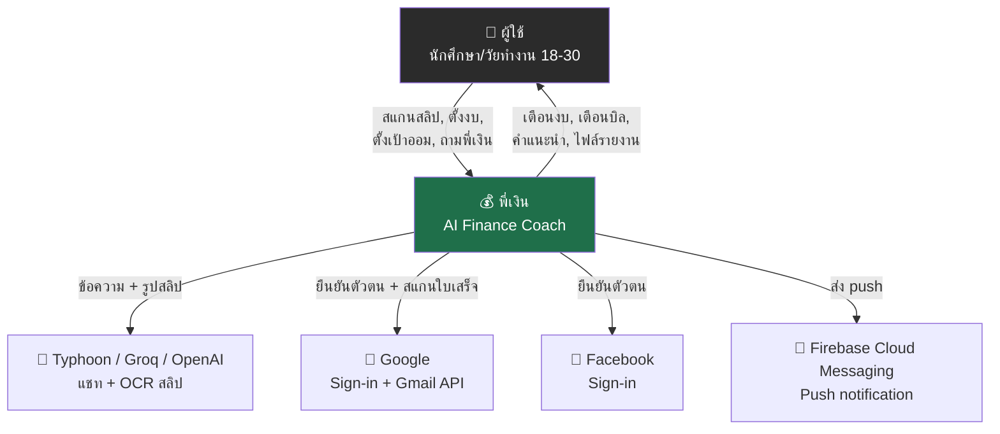

**ขอบเขตที่ตั้งใจจำกัด:** ระบบ **ไม่เชื่อมต่อธนาคารโดยตรง** — คำอธิบายอยู่ใน [`SPRINT_PLAN.md`](SPRINT_PLAN.md): iOS อ่านกล่อง SMS ไม่ได้ และ Android โดน Google Play จำกัด `READ_SMS` จึงออกแบบให้ **OCR สลิป + กรอกเร็ว** เป็นทางหลัก นี่เป็นข้อจำกัดเชิงแพลตฟอร์มที่กำหนดรูปร่างของทั้งระบบ

---

## 2. Container — องค์ประกอบระดับ runtime

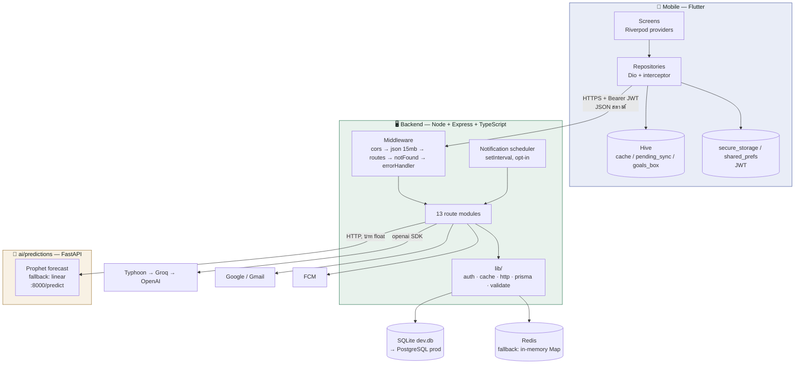

| Container | ที่อยู่ | หน้าที่ | ถ้าตายจะเกิดอะไร |
|---|---|---|---|
| Mobile | `mobile/` | UI, offline-first cache, คิวเขียนตอนออฟไลน์ | — |
| Backend | `backend/` | business logic ทั้งหมด, orchestrate LLM/OCR, สร้างไฟล์ | ระบบหยุด |
| SQLite/Postgres | `backend/prisma/` | ข้อมูลถาวรทั้งหมด | ระบบหยุด (`/health` **ยังคืน 200 — ดูความเสี่ยง R-9**) |
| Redis | optional | cache, rate limit, เก็บ payload export 15 นาที | ตกไปใช้ in-memory อัตโนมัติ |
| FastAPI Prophet | `ai/predictions/app.py` | พยากรณ์กระแสเงินสด + จับรายจ่ายผิดปกติ | หน้าพยากรณ์ขึ้น error, ที่เหลือทำงานปกติ |
| LLM chain | ภายนอก | แชท, OCR, เรียบเรียงแผนออม, การ์ดแนะนำ | ตกไปใช้ rule-based, **OCR ใช้ไม่ได้** |

**ข้อสังเกตสำคัญ:** `ai/coach/` และ `ai/ocr_spike/` เป็น **spike ที่ถูกแทนที่แล้ว** — ของจริงย้ายไปเขียนเป็น TypeScript ที่ `backend/src/modules/chat/` มีเพียง `ai/predictions/app.py` เท่านั้นที่เป็น service จริงในเส้นทาง request

---

## 3. Tech stack และเหตุผลที่เลือก

| ชั้น | เทคโนโลยี | เหตุผล |
|---|---|---|
| Mobile | Flutter 3.19+, Riverpod 2.5, go_router 14, Dio 5 | codebase เดียวได้ iOS + Android ตามข้อกำหนดโปรเจกต์ |
| Local storage | Hive + flutter_secure_storage (native) / shared_preferences (web) | แยกตามแพลตฟอร์มเพราะ `crypto.subtle` ต้องการ secure context บนเว็บ (`api_client.dart:16`) |
| Backend | Node 20 + Express 4 + TypeScript | ทีมคุ้นเคย, ecosystem SDK ครบ |
| ORM | Prisma | type-safe + `db push` เร็วสำหรับ sprint สั้น |
| DB | SQLite (dev) → PostgreSQL (prod) | ให้ทุกคนในทีม `npm run dev` ได้ทันทีโดยไม่ต้องลง service |
| LLM | Typhoon → Groq → OpenAI | Typhoon เข้าใจไทยดีสุด, Groq เร็ว, OpenAI เป็นตาข่ายสุดท้าย — **ทั้ง 3 ใช้ `openai` SDK ตัวเดียว** เพราะทุกเจ้ามี OpenAI-compatible endpoint จึงสลับได้ด้วยการเปลี่ยน `baseURL` |
| OCR | Typhoon OCR (vision) | โมเดลไทย, ทำงานฝั่ง server จึงไม่ต้องฝัง ML Kit ในแอป |
| ML forecast | Python + Prophet | Prophet เป็นมาตรฐาน time-series; แยกเป็น service เพราะ Node ไม่มี lib เทียบเท่า |
| Cache | Redis (optional) | มี in-memory fallback เพื่อไม่บังคับให้ dev ต้องลง Redis |

---

## 4. หลักการออกแบบ 5 ข้อที่ยึดทั้งระบบ

### 4.1 เงินเป็นจำนวนเต็มหน่วยสตางค์ ตลอดเส้นทาง

`lib/validate.ts:3` — `1 บาท = 100 สตางค์` ไม่มี float ในฐานข้อมูลเลย นี่คือมาตรฐานอุตสาหกรรมการเงิน เพราะ `0.1 + 0.2 !== 0.3` ใน IEEE 754 การเก็บเป็น float จะทำให้ยอดเพี้ยนสะสม

การแปลงเป็นบาทเกิดขึ้นที่ **ขอบระบบเท่านั้น** (ดู [ส่วนที่ 9](#9-หน่วยเงิน--แผนที่เขตแดน))

### 4.2 Graceful degradation ทุกชั้น — รันด้วย `.env` ว่างเปล่าได้

ทุก dependency ภายนอกเป็น optional ทั้งหมด ระบบไม่เคย crash เพราะขาด key แต่จะ **ลดความสามารถลงอย่างเงียบ ๆ** แทน ([ตารางเต็มในส่วนที่ 11](#11-failure-mode-matrix))

### 4.3 คำนวณตัวเลขด้วยโค้ด ให้ LLM แค่เรียบเรียง

นี่คือหลักการที่สำคัญที่สุดของระบบการเงินที่ใช้ AI **LLM ไม่เคยเป็นผู้คำนวณตัวเลขที่ผู้ใช้จะเห็น**

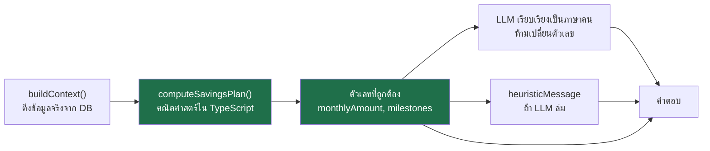

ผลพลอยได้: `heuristicMessage` ใช้ object ตัวเลขชุดเดียวกับที่ส่งให้ LLM → **ตัวเลขตรงกันทั้งสองเส้นทาง** ผู้ใช้แยกไม่ออกว่าตอนนั้นมี LLM หรือไม่

หลักการเดียวกันขยายไปถึง `normalizeSavingsPlanDates` (`chat/export_intent.ts:185`) ที่ **ทิ้งคอลัมน์วันที่ของ LLM แล้วสร้างใหม่จากวันที่จริง** เพราะ LLM แทบทุกตัวจะ default "เดือนที่ 1 = มกราคม" ต่อให้พรอมป์สั่งแล้วก็ตาม และ **คำนวณยอดสะสมเองในโค้ด** เพราะ LLM คิดผลรวมสะสมผิดบ่อย

### 4.4 ความปลอดภัยเชิงเนื้อหาบังคับที่ server ไม่ใช่ที่พรอมป์

`chat/finance_scope.ts` ตัดสินว่าข้อความอยู่ในขอบเขตหรือไม่ **ก่อนเรียก LLM** และข้อความปฏิเสธเป็น constant ของ server (`OUT_OF_SCOPE_REPLY`) คอมเมนต์บรรทัด 10 ระบุเหตุผลตรง ๆ: เพื่อไม่ให้ผู้ใช้พูดจน LLM หลุดกรอบได้ — prompt injection ทำอะไรกับด่านนี้ไม่ได้เพราะมันไม่ใช่ LLM

### 4.5 Ownership บังคับที่ query ไม่ใช่ที่ middleware

ทุก route ที่รับ `:id` จะ `findFirst({ where: { id, userId } })` ก่อน แล้วค่อย mutate — ไม่มี middleware กลางที่ตรวจสิทธิ์ ข้อดีคือชัดเจนตรงจุด ข้อเสียคือ **ถ้าลืมที่ route ใหม่จะไม่มีอะไรจับได้** (ดู R-7)

---

## 5. แผนที่โมดูล

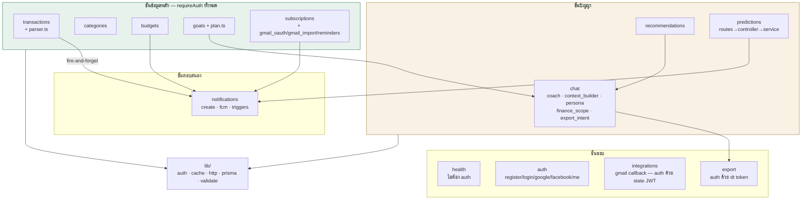

**ข้อสังเกตทางสถาปัตยกรรม:** `chat/` ไม่ได้เป็นแค่โมดูลแชท แต่เป็น **ชั้นบริการ AI ร่วม** — `goals/plan.ts` และ `recommendations/` เรียก `coach.ts` และ `persona.ts` ข้ามโมดูลมาใช้ ถ้าจะรีแฟกเตอร์ในอนาคต ควรยก `coach/context_builder/persona` ขึ้นไปเป็น `lib/ai/` เพราะตอนนี้ตำแหน่งของมันไม่ตรงกับบทบาท

มีเพียง `predictions` โมดูลเดียวที่มีชั้น controller แยก — โมดูลอื่นเป็น route → prisma ตรง ๆ

---

## 6. Data model

9 model, ทุกความสัมพันธ์ที่ผูกกับผู้ใช้เป็น `onDelete: Cascade` (ลบ user = ข้อมูลหายหมด — สอดคล้อง PDPA)

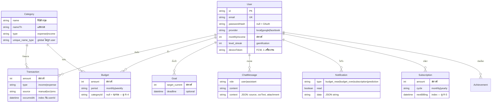

**การตัดสินใจที่ควรรู้:**
- **`Category` เป็น global ไม่ผูก user** — ทุกคนใช้ชุดเดียวกันจาก seed (32 หมวด: 23 รายจ่าย, 9 รายรับ) ผู้ใช้สร้างหมวดเองไม่ได้ นี่เป็น trade-off เพื่อให้ `autoCategorize` และ keyword table ทำงานได้ง่าย
- **`ChatMessage.context` เป็น JSON string** ไม่ใช่ Json column — เพราะ SQLite ไม่รองรับ ผลคือ query ตาม field ข้างในไม่ได้ ต้อง `JSON.parse` ในโค้ด (`chat.routes.ts:71`)
- **`Achievement` ไม่มี route ไหนใช้เลย** — เตรียมไว้สำหรับ gamification ใน Sprint 6

ERD ฉบับเต็มพร้อมทุก field: [`database-erd.md`](database-erd.md)

---

## 7. วงจรชีวิตของ request

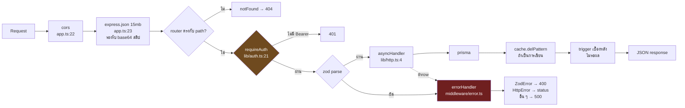

**จุดที่ต้องเข้าใจ:**
- `asyncHandler` (`lib/http.ts:4-8`) ห่อทุก route แล้ว `.catch(next)` — ถ้าไม่มีตัวนี้ error จาก async function จะไม่ถึง `errorHandler` เลย (Express 4 ไม่จับ promise rejection ให้)
- `errorHandler` ต้องมี **4 พารามิเตอร์** และอยู่ **ท้ายสุด** — นี่คือวิธีที่ Express รู้ว่ามันเป็น error middleware
- Trigger ทำงานแบบ fire-and-forget (`transactions.routes.ts:134`) → **response กลับไปหาผู้ใช้ก่อนที่ notification จะถูกสร้าง** เป็นการแลกความสดของ notification กับความเร็วของ API

---

## 8. Workflow ทั้งหมด

### 8.1 สมัคร / เข้าสู่ระบบ

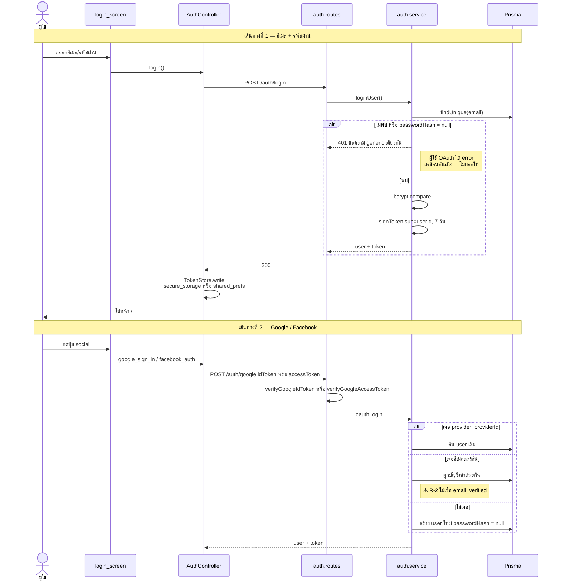

**การตัดสินใจ:** JWT ไม่มี refresh token — อายุ 7 วันแล้วหมด ผู้ใช้ต้องล็อกอินใหม่ เหมาะกับ scope ของโปรเจกต์ แต่ **ฝั่งแอปไม่มี 401 interceptor** (`api_client.dart:60`) ทำให้ตอน token หมดอายุผู้ใช้จะติดค้างแทนที่จะถูกพาไปหน้า login (R-8)

### 8.2 สแกนสลิป → บันทึกรายการ (workflow หลักของแอป)

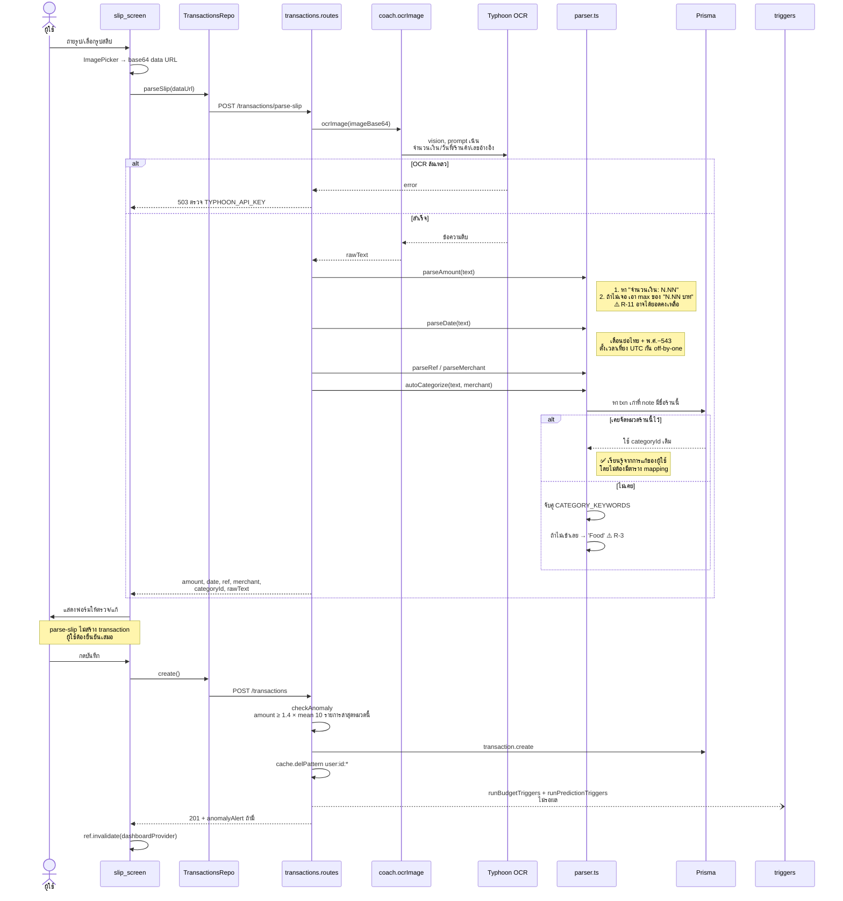

**การออกแบบที่ควรชี้:** `parse-slip` = `analyze-text` + OCR นำหน้า ทั้งคู่ **ไม่สร้างรายการเอง** — คืนค่าให้ผู้ใช้ตรวจก่อนเสมอ นี่ถูกต้องสำหรับข้อมูลการเงินที่ OCR อาจผิด

### 8.3 แชทกับพี่เงิน — pipeline ที่ซับซ้อนที่สุด

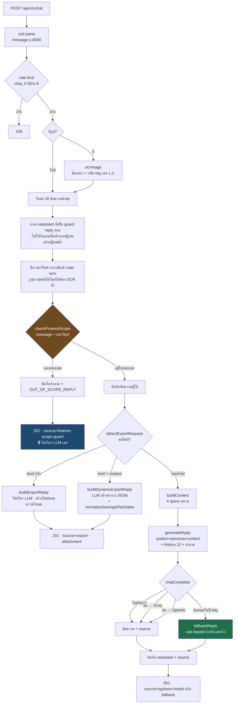

**ลำดับของด่านกรอง** (`finance_scope.ts:74-98`) — ตัดสินตามลำดับนี้ เจอข้อไหนก่อนจบเลย:

| # | เงื่อนไข | ผล | เหตุผล |
|---|---|---|---|
| 1 | เข้า finance pattern (20 regex) | ✅ อนุญาต | กว้างไว้ก่อน — คนพูดว่า "เงิน" ไม่ใช่ศัพท์การเงิน |
| 2 | มีรูป แต่ไม่มีสัญญาณการเงิน | ❌ ปฏิเสธ | กันใช้ช่องอัปโหลดรูปถาม "รูปนี้คืออะไร" |
| 3 | ทั้งข้อความเป็นทักทาย/ถามความสามารถ | ✅ อนุญาต | anchored `^...$` เท่านั้น |
| 4 | follow-up สั้น + ประวัติมีเรื่องการเงิน | ✅ อนุญาต | "ทำไม" "อธิบายเพิ่ม" ต้องต่อบทได้ |
| 5 | นอกนั้น | ❌ ปฏิเสธ | |

**การเลือก provider** (`coach.ts:23-32`) — เรียงตาม key ที่ตั้งไว้ ไม่มี key = ข้าม:

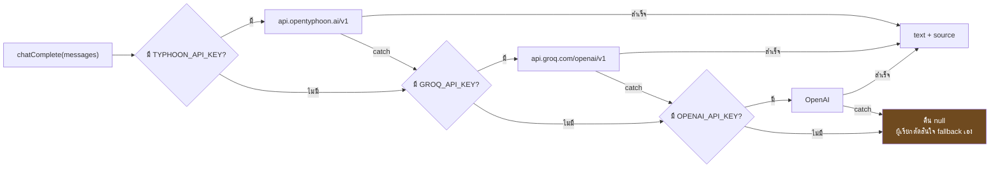

ผู้เรียก `chatComplete` ทั้ง 4 แห่ง (`chat`, `goals/plan.ts`, `recommendations`, `export_intent`) **มี heuristic fallback ของตัวเองทุกตัว** — นี่คือเหตุผลที่ระบบไม่มี LLM key ก็ยังใช้งานได้ครบ

### 8.4 ส่งออกไฟล์จากแชท

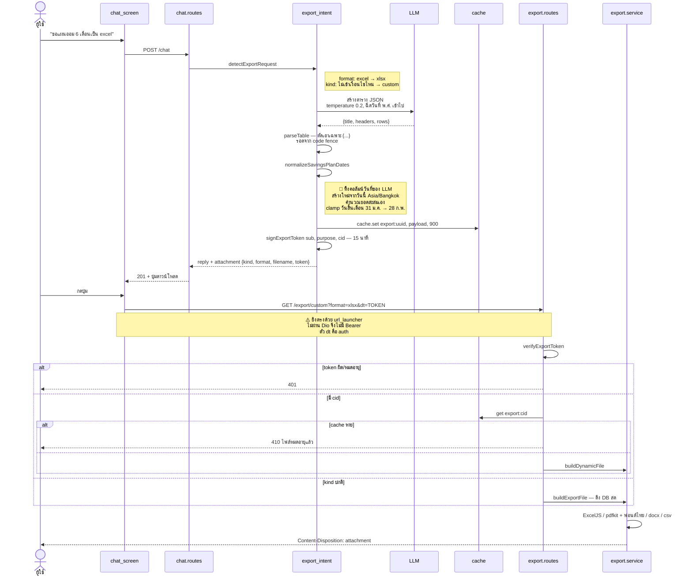

**การตัดสินใจ:** ไฟล์ของ `kind` ที่รู้จัก (budget/transactions/summary/subscriptions) **สร้างตอนดาวน์โหลด** จาก DB สด ส่วน custom ต้อง cache ไว้เพราะเป็นผลจาก LLM ที่สร้างซ้ำไม่ได้ — TTL 15 นาทีตรงกับอายุ token พอดี (ตั้งใจ)

รองรับ 8 ฟอร์แมต: `xlsx, xml, pdf, docx, csv, json, txt, html`

### 8.5 คำนวณสถานะงบ

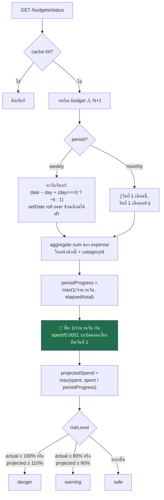

`projectedSpend` คือ **linear extrapolation** — "ใช้ไป X ในเวลา P% ของงวด → ทั้งงวดจะใช้ X/P" ส่วน buffer 10% ในฝั่ง projected (1.1/0.9) คือการยอมให้พยากรณ์คลาดได้บ้างก่อนจะตกใจ

⚠️ **หน้าจอกับ notification ใช้เกณฑ์คนละชุด** — `/status` ดู projected ด้วย แต่ `triggers.ts` ดูแค่ actual ratio ผู้ใช้จึงเห็นสถานะ danger บนจอโดยไม่ได้รับแจ้งเตือน ควรแยกฟังก์ชันคำนวณออกมาใช้ร่วมกัน

### 8.6 เป้าออม + แผน AI

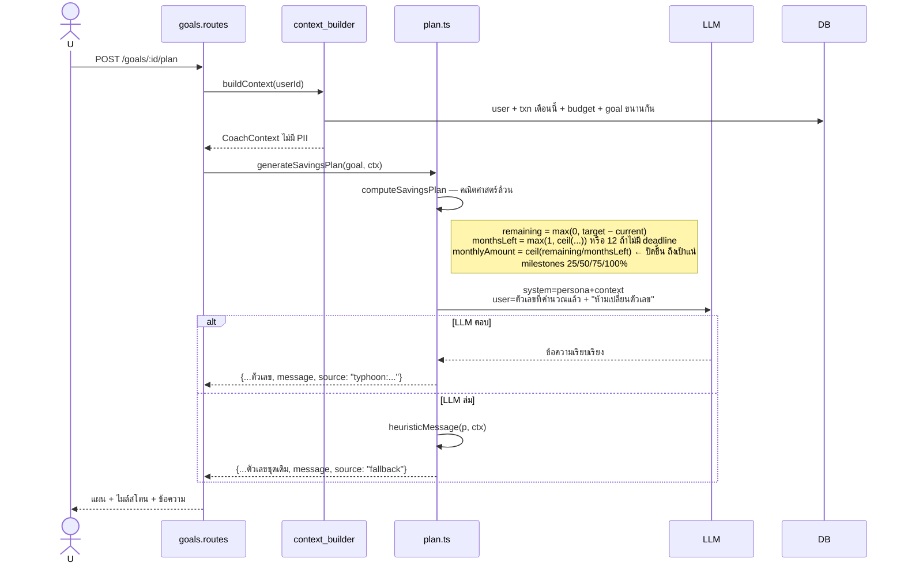

**ทำไม `Math.ceil`:** ออมน้อยไป 1 สตางค์ต่อเดือน = ไม่ถึงเป้า ปัดขึ้นเสมอจึงถูกต้องเชิงการเงิน และพิสูจน์ได้ว่า `ceil(remaining / ceil(remaining/monthsLeft)) ≤ monthsLeft` — ไมล์สโตน 100% ไม่มีทางเกินเดดไลน์

**`{ increment: amount }` ใน deposit** (`goals.routes.ts:116`) แปลเป็น SQL `SET current = current + N` ที่ DB ทำเอง → กด deposit พร้อมกัน 2 request เงินไม่หาย ต่างจาก `current: existing.current + amount` ที่เป็น read-modify-write

### 8.7 แจ้งเตือน + scheduler

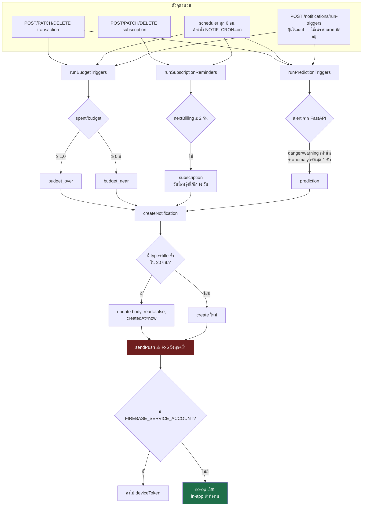

**ทำไม dedupe เป็น 20 ชั่วโมง ไม่ใช่ 24:** scheduler รันทุก 6 ชม. ถ้าใช้ 24 ชม.เป๊ะ การรันที่คลาดไปเล็กน้อยจะถูกกลืน 20 ชม. = "วันละครั้ง" แบบมี slack 4 ชม.

**`fcm.ts` ใช้ `await import('firebase-admin' as any)`** — dynamic import ทำให้ `npm run build` ผ่านแม้ไม่ได้ `npm i firebase-admin` เป็นเทคนิค optional dependency ที่ถูกต้อง

### 8.8 พยากรณ์กระแสเงินสด

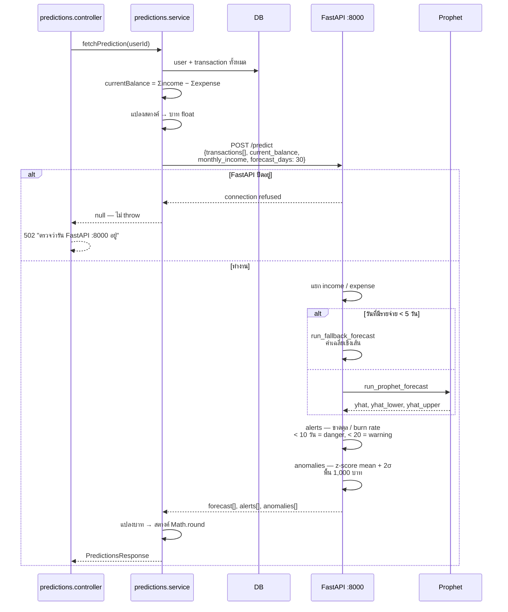

**เหตุผลที่แยกเป็น service ต่างหาก:** Prophet เป็น Python-only และงาน time-series ไม่ควรอยู่ใน request path ของ Node ราคาที่จ่ายคือ operational overhead (ต้องรัน 2 process) และ latency ข้าม process

### 8.9 นำเข้า subscription จาก Gmail

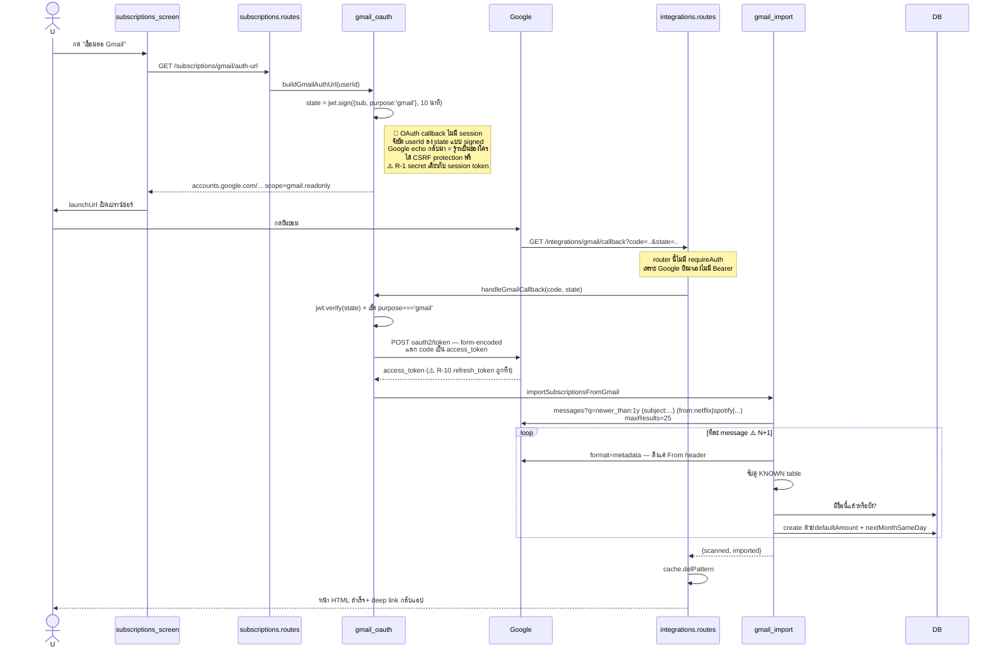

**การตัดสินใจ:** ยอดเงินใช้ **ราคา default ที่ hardcode ไว้** ไม่ได้อ่านจากเนื้อเมล — คอมเมนต์ `gmail_import.ts:5` ระบุตรง ๆ ว่าอ่านยอดจากเนื้อเมลแม่นยำยาก จึงยอมแลกความแม่นกับความง่าย แล้วให้ผู้ใช้แก้เอง เป็น trade-off ที่ยอมรับได้ แต่ราคาที่ hardcode จะเน่าเมื่อผู้ให้บริการขึ้นราคา

### 8.10 Offline-first ฝั่งแอป

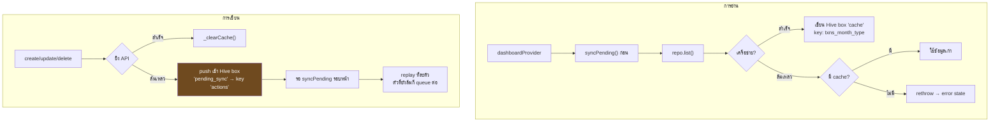

⚠️ **ข้อบกพร่องเชิงออกแบบ:** `catch` ครอบกว้างเกินไป (`transactions_repository.dart:109`) — error 4xx (validation ผิด) ก็ถูกตีความว่า "ออฟไลน์" แล้วเข้าคิว → **poison queue ที่ retry ไม่มีวันจบ** ควรแยก network error ออกจาก HTTP error และไม่มี idempotency key จึงเกิดรายการซ้ำได้เมื่อ request สำเร็จแต่ response หายระหว่างทาง (ยิ่งเกิดง่ายเพราะ `receiveTimeout` ตั้งไว้แค่ 10 วินาที)

---

## 9. หน่วยเงิน — แผนที่เขตแดน

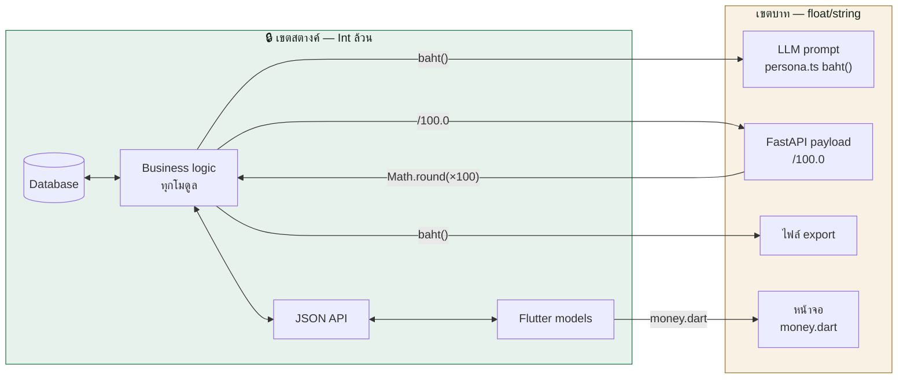

**กฎเหล็ก:** ตัวเลขจะข้ามเส้นนี้ได้เฉพาะ 4 จุดที่ระบุ ถ้าเจอ `/100` หรือ `*100` ที่อื่นในโค้ด **นั่นคือบั๊ก** (เช่น `budget_edit_screen.dart:57` ที่ `~/ 100` แล้ว `* 100` ทำให้ ฿10.99 กลายเป็น ฿10)

**ขากลับจาก Python ต้อง `Math.round`** เสมอ เพราะ Prophet คำนวณต่อแล้วได้ float ที่มีเศษ (`1234.5600000000001 * 100`)

---

## 10. Caching

| Key | TTL | ใช้ทำอะไร |
|---|---|---|
| `user:{id}:transactions:{month}:{type}` | 300s | รายการ + สรุป |
| `user:{id}:transactions_aggregate:{by}:{period}:{month}` | 300s | ข้อมูลกราฟ |
| `user:{id}:budgets:{period}` / `:budget_status` | 300s | งบ |
| `user:{id}:goals` / `:subscriptions` | 300s | |
| `user:{id}:rec:{context}` | **600s** | การ์ดแนะนำ — ยาวกว่าเพราะแต่ละครั้งเผา token จริง |
| `chat_rl:{userId}` | 60s | rate limit |
| `export:{uuid}` | **900s** | payload ไฟล์ custom — ตรงกับอายุ token |

**Invalidation เป็นแบบ shotgun** — ทุกการเขียนเรียก `cache.delPattern('user:{id}:*')` ล้างทุก key ของผู้ใช้คนนั้น รวมถึง `rec:` ด้วย (ตั้งใจ — คำแนะนำต้องสดตามข้อมูล) แลกความแม่นยำกับความง่าย เหมาะกับขนาดระบบนี้

**ความเสี่ยง:** in-memory fallback ทำให้ `export:{uuid}` **ใช้ไม่ได้เมื่อรันหลาย instance** — instance A เขียน instance B มองไม่เห็น → ผู้ใช้ได้ 410 ทั้งที่ยังไม่ถึง 15 นาที **ถ้าจะ scale เกิน 1 process ต้องมี Redis**

---

## 11. Failure mode matrix

| อะไรล่ม | ระบบทำอะไร | ผู้ใช้เห็นอะไร | ระดับ |
|---|---|---|---|
| ไม่มี LLM key / LLM ล่มทุกเจ้า | `chatComplete` → `null` → heuristic | คำตอบ rule-based ที่**ยังอ้างตัวเลขจริง** แยกแทบไม่ออก | 🟢 |
| Typhoon ล่ม (Groq/OpenAI ยังอยู่) | ข้ามไป provider ถัดไป | ไม่รู้สึกอะไร (`source` เปลี่ยน) | 🟢 |
| **Typhoon ล่ม (OCR)** | ไม่มี fallback — OCR ผูกกับ Typhoon เจ้าเดียว | **สแกนสลิปไม่ได้ 503** | 🔴 |
| Redis ล่ม/ไม่มี | ตกไปใช้ in-memory Map | ไม่รู้สึก (ยกเว้น export custom เมื่อมีหลาย instance) | 🟡 |
| ไม่มี FCM creds | `sendPush` no-op | ไม่มี push แต่ notification center ในแอปครบ | 🟡 |
| FastAPI ล่ม | `fetchPrediction` คืน `null` | หน้าพยากรณ์ขึ้น error + ปุ่มลองใหม่ (**พิมพ์ error ดิบให้ดู**) ที่เหลือปกติ | 🟡 |
| DB ล่ม | ไม่มี fallback | ทุกอย่างพัง — **`/health` ยังคืน 200 (R-9)** | 🔴 |
| Hive ล่ม (เว็บ) | `_openBoxSafely` คืน null | ไม่มี offline cache ต้องออนไลน์เสมอ | 🟢 |
| แอปออฟไลน์ | อ่านจาก Hive, เขียนเข้าคิว | ใช้งานต่อได้ sync ทีหลัง (⚠️ poison queue) | 🟡 |
| Gmail token หมดอายุกลางคัน | `if (!mRes.ok) continue` | คืน `imported: 0` **เหมือนไม่มีอะไรผิด** | 🟡 |

---

## 12. Deployment และ configuration

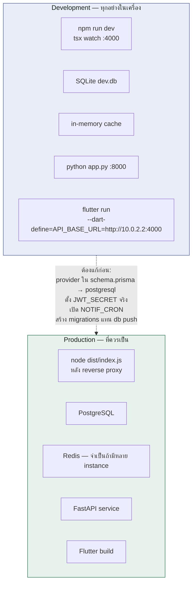

**เส้นทางค่า `API_BASE_URL`:** `api_client.dart:8` ใช้ `String.fromEnvironment` default `http://10.0.2.2:4000` (คือ `localhost` ของเครื่อง host เมื่อมองจาก Android emulator) iOS simulator ใช้ `localhost` ส่วนมือถือจริงบน LAN ต้องใช้ IP ของเครื่อง — เหตุนี้ `index.ts:8` จึง bind `0.0.0.0` อย่างจงใจ

### ตัวแปรสภาพแวดล้อม

| ตัวแปร | Default | ผลถ้าไม่ตั้ง |
|---|---|---|
| `DATABASE_URL` | `file:./dev.db` | ใช้ SQLite |
| **`JWT_SECRET`** | **`dev-insecure-secret-change-me`** | **🔴 ปลอม token ได้ทุกใบ — R-3** |
| `JWT_EXPIRES_IN` | `7d` | |
| `PORT` / `CORS_ORIGIN` | `4000` / `*` | |
| `TYPHOON_API_KEY` | — | ไม่มีแชท LLM **และไม่มี OCR** |
| `TYPHOON_MODEL` / `TYPHOON_OCR_MODEL` | `typhoon-v2.5-30b-a3b-instruct` / `typhoon-ocr-v1.5` | |
| `GROQ_API_KEY` / `OPENAI_API_KEY` | — | ลด provider ในเชน |
| `GOOGLE_CLIENT_ID` | — | ปิด Google login (comma-separated: web,android,ios — **web ต้องเป็นตัวแรก**) |
| `GOOGLE_CLIENT_SECRET` | — | ปิด Gmail import ฝั่ง server |
| `GMAIL_REDIRECT_URI` | `localhost:4000/api/v1/integrations/gmail/callback` | |
| `WEB_APP_URL` | `localhost:5000` | deep link หลัง OAuth |

**ตัวแปรที่อ่าน `process.env` ตรง ๆ ไม่ผ่าน `env.ts` และไม่มีใน `.env.example`** — เป็นหนี้ทางเทคนิคที่ควรเก็บ:

| ตัวแปร | อ่านที่ | Default |
|---|---|---|
| `REDIS_URL` | `cache.ts:14` | ไม่มี = in-memory |
| `PREDICTION_API_URL` | `predictions.service.ts:3` | `http://127.0.0.1:8000/predict` |
| `FIREBASE_SERVICE_ACCOUNT` | `fcm.ts:12` | ไม่มี = ปิด push |
| `NOTIF_CRON` | `triggers.ts:85` | **ต้องเป็น `'on'` เป๊ะ ๆ ไม่งั้น scheduler ไม่ทำงาน** |
| `NOTIF_CRON_MS` | `triggers.ts:89` | 6 ชม. (⚠️ ค่าที่ parse ไม่ได้ = รันทุก 1ms — R-12) |

---

## 13. ทะเบียนความเสี่ยงเชิงสถาปัตยกรรม

เรียงตามผลกระทบ × โอกาสเกิด

| ID | ความเสี่ยง | ที่ | ผลกระทบ | แนวทางแก้ |
|---|---|---|---|---|
| **R-1** | **`requireAuth` ไม่ตรวจ `purpose`** — export token (อยู่ใน URL) และ gmail state token (Google เห็น) ใช้เป็น session token ได้เต็มรูปแบบ | `lib/auth.ts:28` | 🔴 ยึดบัญชีได้ 10–15 นาที | ใส่ `purpose:'session'` ตอน sign แล้วบังคับตอน verify + แยก secret ของแต่ละ purpose |
| **R-2** | **OAuth ไม่ตรวจ audience** — `verifyGoogleAccessToken` ไม่เช็ค `aud`, Facebook ไม่เช็คว่า token เป็นของแอปเรา, ผูกบัญชีด้วย email โดยไม่เช็ค `email_verified` | `oauth.service.ts:42,53,77` | 🔴 ล็อกอินเป็นคนอื่นได้ | เช็ค `aud` ให้ตรง client id, ใช้ `debug_token` ของ Facebook, บังคับ `email_verified` ก่อนผูก |
| **R-3** | `JWT_SECRET` fallback เป็น string สาธารณะเงียบ ๆ | `env.ts:11` | 🔴 | throw เมื่อ `NODE_ENV=production` |
| **R-4** | **งบรวม (`categoryId=null`) นับผิด 4 ที่** — query เป็น `WHERE categoryId IS NULL` จึงนับเฉพาะรายจ่ายที่ไม่มีหมวด | `budgets.routes.ts:91`, `triggers.ts:20`, `context_builder.ts:49`, `export.service.ts:108` | 🔴 ฟีเจอร์ไม่ทำงานเลย + safe ตลอดกาล | `...(b.categoryId ? { categoryId } : {})` |
| **R-5** | **ไม่มีใครเลื่อน `nextBilling`** | ทั้ง repo | 🔴 subscription เตือนได้รอบเดียวตลอดชีพ | job เลื่อน +1 เดือน/ปี เมื่อวันผ่าน |
| **R-6** | **push ซ้ำไม่จำกัด** — dedupe กัน row ได้ แต่ `sendPush` ยิงทุกครั้ง + `createdAt` เลื่อนตัวเอง | `create.ts:29` | 🔴 ผู้ใช้ถอนการติดตั้ง | push เฉพาะตอนสร้างใหม่จริง, อย่ารีเซ็ต `read`/`createdAt` |
| **R-7** | Ownership บังคับด้วย convention — `req.userId?` เป็น optional แล้วใช้ `!` ทุกที่ | `express.d.ts:5` | 🟠 route ใหม่ที่ลืม `requireAuth` จะ **compile ผ่านแล้ว query ข้อมูลทุกคน** | แยก type ของ authenticated request |
| **R-8** | ไม่มี 401 interceptor ฝั่งแอป + ไม่มี `refreshListenable` | `api_client.dart:60`, `router.dart:39` | 🟠 token หมดอายุ = ผู้ใช้ติดค้าง | เพิ่ม `onError` → logout → `/login` |
| **R-9** | `/health` คืน 200 แม้ DB ตาย | `health.routes.ts:16` | 🟠 LB ส่ง traffic เข้า pod เสีย | `res.status(db==='ok' ? 200 : 503)` |
| **R-10** | ขอ `access_type=offline` + `prompt=consent` แล้วทิ้ง `refresh_token` | `gmail_oauth.ts:27` vs `:62` | 🟡 ต้องยินยอมใหม่ทุกครั้ง + ขอสิทธิ์เกินจำเป็น | เก็บ refresh token หรือเอา flag ออก |
| **R-11** | `parseAmount` ใช้ `Math.max` | `parser.ts:18` | 🟡 อาจได้ "ยอดคงเหลือ" แทน "จำนวนเงิน" | ให้น้ำหนักตามคีย์เวิร์ด/ตำแหน่ง |
| **R-12** | `Number(NOTIF_CRON_MS)` ไม่ validate | `triggers.ts:89` | 🟡 พิมพ์ผิด = รันทุก 1ms | `Number.isFinite(n) && n >= 60000` |
| **R-13** | ไม่มี timeout ในทุก outbound call | `coach.ts:51`, `predictions.service.ts:52`, `oauth.service.ts:43` | 🟡 request ค้างไม่จำกัด | `AbortSignal.timeout()` |
| **R-14** | **Timezone ไม่สม่ำเสมอ** — บางที่ UTC บางที่ server-local มีที่เดียวที่ใช้ Asia/Bangkok | ทั้งระบบ | 🟡 ขอบเดือน/สัปดาห์เพี้ยน 7 ชม. | บังคับ `TZ=Asia/Bangkok` แล้วเลือกใช้ที่เดียว |
| **R-15** | in-memory cache ทำให้ scale เกิน 1 instance ไม่ได้จริง | `cache.ts` | 🟡 export custom พังแบบสุ่ม | บังคับ Redis ใน prod |
| **R-16** | N+1 หลายจุด — aggregate ต่อ budget, 25 HTTP ต่อ Gmail import | `budgets.routes.ts:86`, `gmail_import.ts:54` | 🟡 ช้าเมื่อโต | `groupBy` / จำกัด concurrency |
| **R-17** | ไม่มี migration — ใช้ `db push` และ provider ยังเป็น sqlite | `package.json:11`, `schema.prisma:10` | 🟡 ขึ้น prod ไม่ได้จริง | `prisma migrate` + เปลี่ยน provider |
| **R-18** | `console.log(req.body)` ในเส้นทาง transaction | `transactions.routes.ts:102` | 🟡 ข้อมูลการเงินลง production log | ถอดออก / ใช้ structured logger ที่ redact |

---

## ภาคผนวก — สิ่งที่ทำถูกแล้ว อย่ารีแฟกเตอร์ทิ้ง

1. **สตางค์เป็น Int ทั้งระบบ** — ไม่มี float error ในเงิน
2. **Half-open interval `[start, next)`** ทุกที่ที่ query ช่วงเวลา — ไม่ต้องกังวลเดือน 28/29/30/31
3. **`Date.UTC(y, m, d, 12, 0, 0)`** (`parser.ts:31`) — เที่ยงวันกัน off-by-one ข้าม timezone ±14 ชม.
4. **`{ increment }`** — atomic จริง ไม่มี lost update
5. **คำนวณด้วยโค้ด ให้ LLM เรียบเรียง** + heuristic ใช้ตัวเลขชุดเดียวกัน
6. **`normalizeSavingsPlanDates`** — ไม่เชื่อ LLM เรื่องวันที่/ยอดสะสม
7. **`finance_scope` กรองก่อนเรียก LLM** + ข้อความปฏิเสธเป็น constant → prompt injection ไม่มีผล
8. **Graceful degradation ทุกชั้น** — รันด้วย `.env` ว่างได้จริง
9. **`await import()` + `as any`** — optional dependency ที่ build ผ่าน
10. **`minimumProgress = 1/จำนวนวันในงวด`** — กัน projection ระเบิดตอนต้นงวด (คนส่วนใหญ่ลืมเคสนี้)
11. **`date − day + (day===0 ? −6 : 1)`** — Monday-start ที่ข้ามเดือน/ปีได้ฟรี
12. **`when` / `titleWhen` แยกกัน** — ใส่ใจไวยากรณ์ไทยจริง
13. **whitelist ก่อนทำ cache key** (`recommendations.routes.ts:51`) — กัน cache pollution
14. **State JWT ใน OAuth** — ไม่ต้องเก็บ session + ได้ CSRF protection ฟรี (แค่ต้องแยก secret)
15. **`_openBoxSafely` คืน null แทน throw** — Hive พังบนเว็บแล้วแอปยังทำงาน

---

*เอกสารนี้สร้างจากการอ่านโค้ดทุกไฟล์ · รายละเอียดระดับบรรทัดของทุกโมดูลและบั๊กทั้ง 70 รายการอยู่ในเอกสารเจาะลึกแยกต่างหาก*
