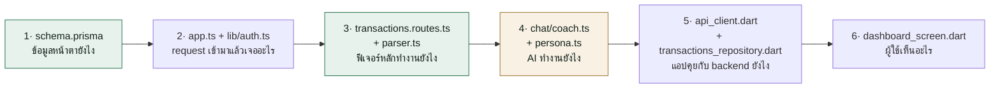

# แผนที่โค้ด — พี่เงิน (AI Finance Coach)

> **เอกสารอ้างอิง** ตอบคำถามเดียว: *"ไฟล์นี้/โฟลเดอร์นี้มีหน้าที่อะไร"*
> ครอบคลุมทุกไฟล์ที่เขียนเอง — backend 44 · mobile 41 · ai 11 · สคริปต์ราก 6
>
> อยากรู้ว่า **ระบบทำงานยังไง** → [`ARCHITECTURE.md`](ARCHITECTURE.md) · อยากรู้ **ทำไมออกแบบแบบนี้** → [`se/design_diagrams.md`](se/design_diagrams.md)

---

## วิธีอ่านเอกสารนี้

แต่ละส่วนเรียงจาก **โฟลเดอร์ → ไฟล์** ตาราง "หน้าที่" บอกความรับผิดชอบเดียวของไฟล์นั้น ส่วนคอลัมน์ "บรรทัด" ช่วยประเมินน้ำหนัก — ไฟล์ที่ยาวผิดปกติมักเป็นจุดที่ควรแยก

สัญลักษณ์ที่ใช้: 🔑 = ไฟล์หัวใจ อ่านก่อน · ⚠️ = มีข้อควรระวัง · 💀 = โค้ดตายแล้ว ลบได้

---

## 1. ภาพรวมทั้งโปรเจกต์

```
Project-JhobSAMNOR/
├── backend/          Node + Express + Prisma — business logic ทั้งหมด
├── mobile/           Flutter + Riverpod — แอปที่ผู้ใช้เห็น
├── ai/               Python — บริการพยากรณ์ (ใช้จริง) + spike เก่า
├── docs/             เอกสารทั้งหมด
├── wallframe/        ภาพ mockup/wireframe อ้างอิงตอนทำ UI
├── *.bat             สคริปต์สั่งรันบน Windows
└── docker-compose.yml   PostgreSQL + Redis สำหรับตอนย้ายออกจาก SQLite
```

**กฎการแบ่งความรับผิดชอบ:** `mobile/` ไม่มี business logic เลย — คำนวณงบ, ตัดสินใจว่าเกินงบไหม, เรียก AI ทั้งหมดอยู่ที่ `backend/` แอปแค่แสดงผลกับส่งข้อมูล ยกเว้นจุดเดียวที่แหกกฎนี้คือ `budgetStatusProvider` (ดูข้อ 4.4)

---

## 2. รากโปรเจกต์ — สคริปต์สั่งรัน

ทั้งหมดเขียนเป็น `.bat` เพราะทีมใช้ Windows ทุกคน จุดประสงค์คือ **กดไฟล์เดียวแล้วรันได้ ไม่ต้องจำคำสั่ง**

| ไฟล์ | หน้าที่ |
|---|---|
| `start-all.bat` | 🔑 **ปุ่มเริ่มงานหลัก** — เปิด backend แล้วรอ 5 วินาที ค่อยเปิดเว็บแอป แยกกันคนละหน้าต่าง |
| `start-backend.bat` | เตรียม backend ให้พร้อมรันแบบครบวงจร: ฆ่า process ที่ค้างพอร์ต 4000 → ก็อป `.env.example` เป็น `.env` ถ้ายังไม่มี → `npm install` ถ้ายังไม่เคยลง → `db:push` → `db:seed` ครั้งแรกครั้งเดียว (จำสถานะด้วยไฟล์ `.seeded`) → `npm run dev` |
| `run-web.bat` | รันแอปบน Chrome **ตรึงไว้ที่ `localhost:5000` เสมอ** — ตรึงเพราะ Google Sign-In ต้องการ origin ที่ตรงกับที่ลงทะเบียนไว้ใน Google Cloud เป๊ะ ๆ เปลี่ยนพอร์ตแล้วล็อกอิน Google จะพัง |
| `run-phone.bat` | รันบนมือถือจริง — **หา LAN IP ของเครื่องอัตโนมัติ** ด้วย PowerShell (กรอง 127.\*, 169.254.\* ออก แล้วเลือกตัวที่ InterfaceMetric ต่ำสุด) แล้วส่งเป็น `API_BASE_URL` ให้แอป เพราะมือถือเรียก `localhost` ของคอมไม่ได้ |
| `run-mobile.bat` | รันบน emulator / อุปกรณ์ที่ Flutter เจอ |
| `run_app.bat` | ทางลัดเรียก `start-all.bat` |

| ไฟล์ | หน้าที่ |
|---|---|
| `docker-compose.yml` | นิยาม PostgreSQL + Redis — **ยังไม่ได้ใช้ใน dev** เตรียมไว้ตอนย้ายจาก SQLite ขึ้น production |
| `README.md` | Quickstart + ตาราง API contract + เหตุผลการตัดสินใจของ Sprint 1 |
| `wallframe/` | ภาพ mockup ที่ใช้อ้างอิงตอนทำ UI (`chat1.png`, `chat2.png`) |

---

## 3. `backend/` — Node + Express + Prisma + TypeScript

### 3.1 โครงสร้างโฟลเดอร์

```
backend/
├── src/
│   ├── index.ts        จุดเริ่มโปรแกรม
│   ├── app.ts          ประกอบ Express
│   ├── config/         อ่าน env
│   ├── lib/            ของใช้ร่วมทุกโมดูล
│   ├── middleware/      จัดการ error
│   ├── types/          ขยาย type ของ Express
│   └── modules/        แบ่งตามโดเมนธุรกิจ 13 โมดูล
├── prisma/             schema + seed + dev.db
├── assets/fonts/       ฟอนต์ไทยสำหรับสร้าง PDF
└── dist/               ผลลัพธ์จาก tsc (build แล้ว ไม่ต้องแก้)
```

**หลักการแบ่ง:** โฟลเดอร์ใน `modules/` = **1 โดเมนธุรกิจ** ไม่ใช่ 1 เทคนิค (ไม่มีโฟลเดอร์ `controllers/` `services/` รวมทุกโดเมน) ผลคือแก้ฟีเจอร์งบประมาณ = เปิดโฟลเดอร์ `budgets/` โฟลเดอร์เดียวจบ

### 3.2 แกนกลาง

| ไฟล์ | บรรทัด | หน้าที่ |
|---|---:|---|
| `src/index.ts` | 12 | จุดเริ่มโปรแกรม — `createApp()` แล้ว listen พอร์ต 4000 **bind `0.0.0.0` โดยตั้งใจ** (ค่า default ของ Node คือ IPv6 ซึ่งมือถือใน LAN เรียกไม่ถึง) จากนั้นสตาร์ท scheduler แจ้งเตือน |
| `src/app.ts` | 43 | 🔑 ประกอบ Express ตามลำดับที่ห้ามสลับ: `cors` → `express.json({limit:'15mb'})` → mount 13 router → `notFound` → `errorHandler`. limit 15mb เพราะรูปสลิปส่งมาเป็น base64 |
| `src/config/env.ts` | 31 | อ่าน env ทุกตัวไว้ที่เดียว มี default ให้ทุกตัวเพื่อให้รันได้ทันทีโดยไม่ต้องตั้งค่า ⚠️ `JWT_SECRET` ก็มี default → ต้องตั้งจริงก่อนขึ้น production |
| `src/middleware/error.ts` | 21 | ตัวจับ error ตัวสุดท้าย: `ZodError` → 400 พร้อมรายละเอียด, error ที่มี `.status` (คือ `HttpError`) → status นั้น, นอกนั้น → 500 **ต้องมี 4 พารามิเตอร์และอยู่ท้ายสุด** ไม่งั้น Express ไม่รู้ว่าเป็น error middleware |
| `src/types/express.d.ts` | 10 | เติม `req.userId` เข้า type ของ Express ให้ TypeScript รู้จัก |

### 3.3 `src/lib/` — ของใช้ร่วม

| ไฟล์ | บรรทัด | หน้าที่ |
|---|---:|---|
| `lib/prisma.ts` | 3 | สร้าง `PrismaClient` ตัวเดียวใช้ทั้งแอป (กันเปิด connection pool ซ้ำ) |
| `lib/auth.ts` | 34 | 🔑 หัวใจความปลอดภัย — `hashPassword`/`verifyPassword` (bcrypt), `signToken` (อายุ 7 วัน), และ **`requireAuth`** ที่อ่าน `Bearer` แล้วเซ็ต `req.userId` |
| `lib/http.ts` | 17 | `asyncHandler` ห่อ route ให้ `.catch(next)` — **ถ้าไม่มีตัวนี้ error จาก async function จะไม่ถึง errorHandler เลย** และ `HttpError` สำหรับโยน error พร้อม status |
| `lib/validate.ts` | 25 | zod schema ที่ใช้ร่วมหลายที่ (register/login/transaction) จุดที่ประกาศกฎ "เงินเป็นสตางค์ integer" |
| `lib/cache.ts` | 142 | ชั้น cache ที่ใช้ Redis ถ้ามี `REDIS_URL` ไม่งั้นตกไปใช้ `Map` ในหน่วยความจำ — `get/set/del/delPattern` ⚠️ `delPattern` ใช้ Redis `KEYS` ซึ่ง block ทั้ง instance |

### 3.4 `src/modules/` — 13 โมดูลตามโดเมน

#### `transactions/` — รายรับรายจ่าย (โมดูลที่ใหญ่และสำคัญที่สุด)

| ไฟล์ | บรรทัด | หน้าที่ |
|---|---:|---|
| `transactions.routes.ts` | 372 | 🔑 CRUD รายการ + `GET /aggregate` (ข้อมูลกราฟ แบ่งตามหมวดหรือตามเวลา) + `POST /parse-slip` (รูป→OCR→แกะ) + `POST /analyze-text` (ข้อความ→แกะ) และ `checkAnomaly` ที่เตือนเมื่อยอด ≥ 1.4 เท่าของค่าเฉลี่ย 10 รายการล่าสุดในหมวดเดียวกัน |
| `parser.ts` | 152 | 🔑 **สมองการอ่านสลิปไทย** — regex ล้วน ไม่มี ML: `parseAmount` (หา "จำนวนเงิน" ก่อน ไม่เจอค่อยเอาเลขที่มากสุด), `parseDate` (เดือนย่อไทย + แปลง พ.ศ.), `parseRef`, `parseMerchant`, และ `autoCategorize` ที่**ดูก่อนว่าผู้ใช้เคยจัดร้านนี้ไว้หมวดไหน** ค่อยตกไปที่ตาราง keyword |

#### `chat/` — โค้ช AI "พี่เงิน" (ที่จริงคือชั้นบริการ AI ร่วมของทั้งระบบ)

| ไฟล์ | บรรทัด | หน้าที่ |
|---|---:|---|
| `chat.routes.ts` | 166 | 🔑 pipeline การตอบแชท: rate limit → OCR ถ้ามีรูป → โหลดประวัติ → ตรวจขอบเขต → เช็คว่าขอไฟล์ไหม → เรียก LLM → บันทึก |
| `coach.ts` | 153 | 🔑 คุยกับ LLM — `chatComplete` วนลอง **Typhoon → Groq → OpenAI** (ทั้ง 3 ใช้ `openai` SDK ตัวเดียว เปลี่ยนแค่ `baseURL`) ล้มหมดคืน `null`; `ocrImage` (Typhoon vision); `fallbackReply` ตอบด้วยกฎเมื่อไม่มี LLM |
| `context_builder.ts` | 69 | ประกอบ "ข้อมูลผู้ใช้ ณ ตอนนี้" ป้อน LLM — รายรับ/รายจ่ายเดือนนี้, 3 หมวดที่ใช้เยอะสุด, งบที่เหลือ, เป้าออม **ตั้งใจไม่มี PII** |
| `persona.ts` | 77 | บุคลิกและกฎของพี่เงินทั้งหมด — ขอบเขตที่ตอบได้, ห้ามแนะนำหุ้นรายตัว, ห้ามใช้ตาราง (เพราะ chat bubble แคบ), กฎการส่งออกไฟล์ + ฟังก์ชัน `baht()` แปลงสตางค์เป็นข้อความ |
| `finance_scope.ts` | 98 | 🔑 **ด่านกรองก่อนถึง LLM** — ตัดสินด้วย regex ว่าคำถามอยู่ในขอบเขตการเงินไหม ข้อความปฏิเสธเป็น constant ของ server → prompt injection พูดให้หลุดกรอบไม่ได้ |
| `export_intent.ts` | 226 | ตรวจว่าผู้ใช้ขอไฟล์ + เลือกฟอร์แมต + ให้ LLM สร้างตาราง แล้ว **`normalizeSavingsPlanDates` ทิ้งคอลัมน์วันที่ของ LLM สร้างใหม่จากวันจริง** เพราะ LLM มักตอบเป็นมกราคมเสมอ |

#### `budgets/` · `goals/` · `categories/`

| ไฟล์ | บรรทัด | หน้าที่ |
|---|---:|---|
| `budgets/budgets.routes.ts` | 216 | CRUD งบ + 🔑 `GET /status` ที่คำนวณ: หน้าต่างงวด (weekly เริ่มวันจันทร์ / monthly), ยอดใช้จริง, **ยอดคาดการณ์สิ้นงวด** และระดับความเสี่ยง safe/warning/danger |
| `goals/goals.routes.ts` | 153 | CRUD เป้าออม + `POST /:id/deposit` ที่ใช้ `{increment}` ของ Prisma เพื่อให้ **atomic จริง** (กดพร้อมกันเงินไม่หาย) + `POST /:id/plan` |
| `goals/plan.ts` | 100 | 🔑 **ตัวอย่างการใช้ LLM ที่ถูกต้อง** — `computeSavingsPlan` คำนวณด้วย TypeScript (ต้องออมเดือนละเท่าไร, ไมล์สโตน 25/50/75/100%) แล้วให้ LLM **แค่เรียบเรียงเป็นภาษาคน** ห้ามเปลี่ยนตัวเลข; ถ้า LLM ล่มใช้ `heuristicMessage` ที่อ้างตัวเลขชุดเดียวกัน |
| `categories/categories.routes.ts` | 15 | คืนหมวดหมู่ทั้งหมด — เป็น master data กลาง ไม่ผูกผู้ใช้ ทุกคนเห็นชุดเดียวกัน |

#### `auth/` — ยืนยันตัวตน

| ไฟล์ | บรรทัด | หน้าที่ |
|---|---:|---|
| `auth.routes.ts` | 73 | 5 endpoint: register, login, google, facebook, me |
| `auth.service.ts` | 54 | สมัคร/เข้าสู่ระบบด้วยอีเมล + `publicUser()` ที่กรอง `passwordHash` ออกก่อนส่งกลับ |
| `oauth.service.ts` | 105 | ตรวจ token จาก Google/Facebook + `oauthLogin` ที่ทำ 3 ขั้น: หาด้วย provider → หาด้วยอีเมลแล้วผูกบัญชี → สร้างใหม่ ⚠️ ตรงนี้มีช่องโหว่ (ดู R-2 ใน ARCHITECTURE.md) |

#### `notifications/` — แจ้งเตือน

| ไฟล์ | บรรทัด | หน้าที่ |
|---|---:|---|
| `notifications.routes.ts` | 67 | รายการแจ้งเตือน + อ่านแล้ว + ลงทะเบียน FCM token + ปุ่ม `run-triggers` (มีไว้เดโมเพราะ cron ปิดอยู่) |
| `create.ts` | 38 | `createNotification` — **กันเตือนซ้ำเรื่องเดิมภายใน 20 ชม.** (20 ไม่ใช่ 24 เพราะ scheduler รันทุก 6 ชม. ถ้าใช้ 24 เป๊ะการรันที่คลาดนิดเดียวจะถูกกลืน) |
| `fcm.ts` | 43 | ส่ง push — **`await import('firebase-admin')` แบบ dynamic** ทำให้ `npm run build` ผ่านแม้ไม่ได้ลง lib ไม่มี credential ก็เงียบไปเฉย ๆ แอปยังใช้ได้ครบ |
| `triggers.ts` | 97 | เงื่อนไขการเตือน: ใช้ ≥ 80% ของงบ → เตือนใกล้เต็ม, ≥ 100% → เตือนเกินงบ + `startNotificationScheduler` ที่รันทุก 6 ชม. **ต้องตั้ง `NOTIF_CRON=on` ถึงจะทำงาน** (default ปิด) |

#### `predictions/` — พยากรณ์ (โมดูลเดียวที่มีชั้น controller)

| ไฟล์ | บรรทัด | หน้าที่ |
|---|---:|---|
| `predictions.routes.ts` | 11 | ประกาศ route อย่างเดียว |
| `predictions.controller.ts` | 19 | แปลงผลเป็น HTTP — ได้ `null` → ตอบ 502 พร้อมข้อความบอกว่าให้ไปเช็ค FastAPI |
| `predictions.service.ts` | 86 | 🔑 สะพานไป Python — รวบ transaction, **แปลงสตางค์เป็นบาท** (Prophet ต้องการ float), POST ไป `:8000/predict`, แล้ว **แปลงกลับเป็นสตางค์** ด้วย `Math.round` |
| `prediction_triggers.ts` | 45 | กรองผลพยากรณ์เป็นแจ้งเตือน — เอาเฉพาะ warning/danger + รายจ่ายผิดปกติเด่นสุด 1 รายการ (notification เป็นทรัพยากรแพง ไม่ยิงทุกอย่าง) |

#### `subscriptions/` — ค่าสมาชิกรายเดือน

| ไฟล์ | บรรทัด | หน้าที่ |
|---|---:|---|
| `subscriptions.routes.ts` | 142 | CRUD + `totalMonthly` ที่แปลงรายปีเป็นรายเดือน (÷12) เพื่อบวกรวมได้ |
| `gmail_oauth.ts` | 67 | สร้าง URL ขอสิทธิ์ Gmail + รับ code มาแลก token — 🔑 **ยัด userId ลง `state` แบบ signed** เพราะ OAuth callback ไม่มี session, ได้ CSRF protection ฟรี |
| `gmail_import.ts` | 85 | ค้นอีเมลใบเสร็จ 1 ปีย้อนหลัง (สูงสุด 25 ฉบับ) → จับคู่ผู้ให้บริการจาก header `From` → สร้าง subscription ด้วย **ราคา default ที่ hardcode ไว้** เพราะอ่านยอดจากเนื้อเมลแม่นยำยาก ให้ผู้ใช้แก้เอง |
| `reminders.ts` | 55 | เตือนบิลที่จะตัดภายใน 2 วัน — มี `when`/`titleWhen` แยกกันเพราะไวยากรณ์ไทยต่างกันตามตำแหน่ง ("ตัดเงิน**ใน** 2 วัน" vs "**อีก** 2 วัน Netflix จะตัด") |

#### `export/` · `recommendations/` · `integrations/` · `health/`

| ไฟล์ | บรรทัด | หน้าที่ |
|---|---:|---|
| `export/export.routes.ts` | 47 | รับดาวน์โหลด — **ไม่ใช้ `requireAuth`** แต่ใช้ token `dt` ใน URL แทน เพราะแอปเปิดลิงก์ตรงไม่ผ่าน Dio จึงแนบ header ไม่ได้ |
| `export/export.service.ts` | 675 | ⚠️ ไฟล์ใหญ่สุดใน backend — สร้างไฟล์ 8 ฟอร์แมต (xlsx/xml/pdf/docx/csv/json/txt/html) `buildRows` ดึงข้อมูลตามชนิด แล้วส่งเข้า renderer ตามฟอร์แมต |
| `recommendations/recommendations.routes.ts` | 80 | การ์ด "แนะนำสำหรับคุณ" — prompt สั้นมาก (≤40 คำ ห้ามตาราง) cache 10 นาทีเพราะแต่ละครั้งเผา token จริง มี `heuristic()` เป็น fallback |
| `integrations/integrations.routes.ts` | 38 | ปลายทางที่ Google redirect กลับมาหลังผู้ใช้กดยินยอม — **ไม่มี `requireAuth`** เพราะ Google ยิงมาเองไม่มี Bearer ตัวตนมาจาก `state` ⚠️ มีช่อง XSS ตรงนี้ (R-6) |
| `health/health.routes.ts` | 18 | เช็คว่าเซิร์ฟเวอร์กับ DB ยังไหวไหม ⚠️ DB ตายก็ยังตอบ 200 (R-9) |

### 3.5 `prisma/` และไฟล์ตั้งค่า

| ไฟล์ | บรรทัด | หน้าที่ |
|---|---:|---|
| `prisma/schema.prisma` | 146 | 🔑 นิยาม 9 ตาราง — **เงินทุกช่องเป็น `Int` หน่วยสตางค์** ทุกความสัมพันธ์ที่ผูกผู้ใช้เป็น `onDelete: Cascade` (ลบ user = ข้อมูลหายหมด สอดคล้อง PDPA) |
| `prisma/seed.ts` | 90 | ใส่หมวดหมู่ 32 หมวด (รายจ่าย 23 / รายรับ 9) + ผู้ใช้เดโม `demo@bestimove.ai` ⚠️ ไม่มี guard `NODE_ENV` |
| `package.json` | — | สคริปต์: `dev` (tsx watch), `build` (tsc), `db:push`, `db:seed`, `db:studio` |
| `.env.example` | — | ต้นแบบ `.env` ⚠️ ยังขาดตัวแปรที่โค้ดอ่านตรงจาก `process.env` (`REDIS_URL`, `NOTIF_CRON`, `PREDICTION_API_URL`, `FIREBASE_SERVICE_ACCOUNT`) |
| `assets/fonts/Sarabun-Regular.ttf` | — | ฟอนต์ไทยสำหรับสร้าง PDF — **ถ้าไม่มี ภาษาไทยใน PDF จะเป็นสี่เหลี่ยม** (`SARABUN-OFL.txt` คือสัญญาอนุญาต ห้ามลบ) |

---

## 4. `mobile/` — Flutter + Riverpod

### 4.1 โครงสร้าง

```
mobile/lib/
├── main.dart       จุดเริ่มแอป
├── app/            เส้นทาง + ธีม (ของทั้งแอป)
├── core/           ของใช้ร่วม — HTTP client, แปลงหน่วยเงิน
└── features/       12 ฟีเจอร์ แต่ละอันมี screen + repository + model อยู่ด้วยกัน
```

**หลักการแบ่ง: feature-first** — ไม่มีโฟลเดอร์ `screens/` `models/` รวมทุกฟีเจอร์ แต่ละโฟลเดอร์ใน `features/` มีทุกอย่างของฟีเจอร์นั้นครบ แก้ฟีเจอร์ไหนก็เปิดโฟลเดอร์นั้น

⚠️ **ชื่อไฟล์ยังไม่สม่ำเสมอ** — บทบาทเดียวกันแต่ตั้งชื่อ 3 แบบ: `*_repository.dart` (transactions, chat), `*_service.dart` (predictions — แต่คลาสข้างในชื่อ `PredictionsRepository`), `*_provider.dart` / `*_controller.dart` (goals, auth)

### 4.2 แกนกลาง

| ไฟล์ | บรรทัด | หน้าที่ |
|---|---:|---|
| `main.dart` | 60 | เริ่มแอป — เปิด Hive และโหลด locale ไทย **แบบ try/catch ทั้งคู่** เพราะบนเว็บ IndexedDB อาจถูกบล็อก แต่แอปต้องเปิดได้อยู่ดี แล้วครอบทุกอย่างด้วย `ProviderScope` |
| `app/router.dart` | 138 | ตารางเส้นทางทั้งหมด (go_router) + logic redirect ⚠️ `initialLocation` ตรึงที่ `/welcome1` เสมอ และ `onboardingDoneProvider` ไม่ถูกบันทึกลงเครื่อง → เปิดแอปทุกครั้งเจอ onboarding ใหม่ |
| `app/theme.dart` | 138 | สีทั้งหมด (`AppColors`), `buildTheme()`, gradient และตำแหน่ง FAB แบบกำหนดเอง — **จุดเดียวที่ควรแก้เวลาปรับหน้าตา** |
| `core/money.dart` | 17 | 🔑 แปลงสตางค์↔บาทและจัดรูปแบบ — **จุดเดียวในแอปที่ควรมีการหาร 100** เจอ `/100` ที่อื่นถือว่าผิด |
| `core/api/api_client.dart` | 68 | 🔑 ตัวเชื่อม backend — `kApiBaseUrl` มาจาก `--dart-define` (default `10.0.2.2:4000` = localhost ของเครื่องเมื่อมองจาก Android emulator), `TokenStore` เก็บ JWT (secure storage บนมือถือ / shared_prefs บนเว็บ), interceptor แนบ `Bearer` ⚠️ `receiveTimeout` แค่ 10 วิ ทำให้แชท/OCR ล้มบ่อย และไม่มีตัวจัดการ 401 |

### 4.3 `features/transactions/` — หัวใจของแอป

| ไฟล์ | บรรทัด | หน้าที่ |
|---|---:|---|
| `transaction.dart` | 150 | model: `Category`, `Txn`, `TxnSummary`, `Budget`, `BudgetStatus` |
| `transactions_repository.dart` | 389 | 🔑 **ไฟล์ที่สำคัญที่สุดฝั่งแอป** — เรียก API ทุกตัวเกี่ยวกับรายการ/งบ + ระบบ **offline-first**: อ่านสำเร็จ→เก็บลง Hive, อ่านไม่ได้→ใช้ของเก่า, เขียนไม่ได้→เข้าคิว `pending_sync` แล้ว replay ทีหลัง ⚠️ catch กว้างเกิน error 4xx ก็เข้าคิว → retry ไม่จบ |
| `slip_screen.dart` | 651 | หน้าสแกนสลิป — เลือกรูป → base64 → `parse-slip` → เติมฟอร์มให้ผู้ใช้ตรวจ → บันทึก **ผู้ใช้ต้องยืนยันเสมอ ไม่บันทึกอัตโนมัติ** เพราะ OCR อาจผิด |

### 4.4 `features/dashboard/`

| ไฟล์ | บรรทัด | หน้าที่ |
|---|---:|---|
| `dashboard_screen.dart` | 1026 | ⚠️ หน้าแรก — ยอดคงเหลือ, การ์ดเป้าออม, การ์ดงบ, รายการล่าสุด, ปุ่มลัด, bottom nav ยาวเกินไป ควรแยก widget ออกเป็นไฟล์ |
| `financial_dashboard_screen.dart` | 1020 | ⚠️ หน้าวิเคราะห์/กราฟ (fl_chart) — เลือกช่วงเวลาได้ |

### 4.5 `features/chat/`

| ไฟล์ | บรรทัด | หน้าที่ |
|---|---:|---|
| `chat_message.dart` | 75 | model ข้อความ + ไฟล์แนบ |
| `chat_repository.dart` | 34 | เรียก `GET /chat` และ `POST /chat` |
| `chat_screen.dart` | 1123 | ⚠️ **ไฟล์ยาวที่สุดในโปรเจกต์** — แสดงข้อความ (markdown), อวตาร/อนิเมชันกำลังพิมพ์, พูดด้วยเสียง (speech_to_text), แนบรูป, ปุ่มดาวน์โหลดไฟล์ (เปิด URL ตรงไม่ผ่าน Dio จึงใช้ token `dt` แทน Bearer) |

### 4.6 `features/` ที่เหลือ

| ไฟล์ | บรรทัด | หน้าที่ |
|---|---:|---|
| **auth/** | | |
| `auth_controller.dart` | 150 | สถานะผู้ใช้ + login/register/logout/google/facebook + `_bootstrap()` ที่เช็ค token ตอนเปิดแอป |
| `login_screen.dart` | 253 | ⚠️ หน้าเข้าสู่ระบบ — **prefill รหัสผ่านเดโมไว้ ต้องลบก่อนส่งจริง** ไม่มี validation |
| `register_screen.dart` | 242 | ⚠️ สมัครสมาชิก — ไม่มี validation, ช่องเบอร์โทรเก็บแล้วไม่เคยส่ง |
| `forgot_password_screen.dart` | 307 | 💀 **stub ทั้งหน้า** — ทั้ง 3 ขั้นมีแค่คอมเมนต์ ไม่ส่ง OTP จริง กด next ทั้งที่ว่างก็ผ่าน |
| `social_login_buttons.dart` | 84 | ปุ่ม Google/Facebook ⚠️ ใช้ไอคอน Material แทนโลโก้ Google จริง (ผิดข้อกำหนด branding) |
| **budgets/** | | |
| `budget_list_screen.dart` | 498 | รายการงบ + แถบความคืบหน้า ⚠️ เช็ค empty ผิด list → ถ้า `/budgets/status` ล่มจะเห็นหน้าว่างเงียบ ๆ |
| `budget_edit_screen.dart` | 509 | แก้งบ ⚠️ ช่องชื่อแก้ได้แต่ไม่เคยถูกส่ง |
| `budget_amount_screen.dart` | 432 | สร้างงบใหม่ ⚠️ ช่วงวันที่ที่เลือกไม่เคยถูกส่ง |
| `budget_duration_screen.dart` | 287 | 💀 **mock ทั้งหน้า** — ข้อมูล hardcode, ปุ่มกดไม่ได้, ปฏิทินเป็นเมษา 2026 ปลอม |
| **goals/** | | |
| `goals_provider.dart` | 223 | ⚠️ model + state เป้าออม เก็บใน Hive **ไม่ต่อ backend เลย** และ seed เป้าปลอม 3 อันให้ผู้ใช้ทุกคน |
| `goals_screen.dart` | 603 | รายการเป้า ⚠️ สีความคืบหน้ากลับด้าน (ออมได้ 80% ขึ้นสีแดง) |
| `edit_goal_screen.dart` | 849 | ⚠️ เพิ่ม/แก้เป้า + ครอปรูป (ครอปเป็นของประดับ ไม่ถูกใช้ตอนบันทึก) |
| `deposit_goal_screen.dart` | 173 | ฝากเงินเข้าเป้า |
| `set_deadline_screen.dart` | 326 | เลือกเดดไลน์ด้วย table_calendar — แสดง พ.ศ. แต่เก็บ ค.ศ. |
| **subscriptions/** | | |
| `subscriptions_repository.dart` | 106 | เรียก API subscription 💀 `importFromGmail` ไม่มีใครเรียก |
| `subscriptions_screen.dart` | 730 | ⚠️ รายการค่าสมาชิก + นำเข้าจาก Gmail — **โหมดเดโมแสดงข้อความว่ากำลังคุยกับ Google ทั้งที่ไม่ได้คุย** แล้วเขียนข้อมูล hardcode ลง DB จริง |
| **notifications/** | | |
| `notifications_repository.dart` | 67 | model + เรียก API แจ้งเตือน |
| `notifications_screen.dart` | 198 | ศูนย์แจ้งเตือน + ปุ่ม "ตรวจตอนนี้" |
| `notif_bell.dart` | 45 | กระดิ่ง + ตัวเลขที่ยังไม่อ่าน ⚠️ ใช้จริงแค่หน้าเมนู หน้าอื่นเป็นกระดิ่งปลอมกดไม่ได้ |
| **predictions/** | | |
| `predictions_model.dart` | 103 | model ผลพยากรณ์ 💀 `lower`/`upper` แปลงมาแล้วไม่เคยวาด |
| `predictions_service.dart` | 30 | เรียก `GET /predictions` |
| `predictions_screen.dart` | 618 | กราฟพยากรณ์ + เตือน + รายจ่ายผิดปกติ ⚠️ pull-to-refresh เป็นฟังก์ชันว่าง และแกน Y ถูกตรึงที่ 0 ทำให้ยอดติดลบหายไป |
| **onboarding/** | | |
| `welcome_1/2/3_screen.dart` | 176/181/183 | 3 หน้าแนะนำแอป ⚠️ โค้ดซ้ำกัน ~95% |
| `welcome_screen.dart` | 3 | 💀 ไฟล์ตาย เขียนไว้ว่า "no longer used" ลบได้ |
| **menu/ · profile/** | | |
| `menu_screen.dart` | 312 | เมนูรวม — บัญชี/Subscription ใช้ได้จริง, ตั้งค่า/ความเป็นส่วนตัวเป็น stub |
| `profile_screen.dart` | 91 | โปรไฟล์ + ออกจากระบบ ⚠️ ใช้ธีมสว่างในแอปธีมมืด (หน้าที่อัปเดตน้อยสุด) |

### 4.7 ไฟล์ตั้งค่าของ mobile

| ไฟล์ | หน้าที่ |
|---|---|
| `pubspec.yaml` | dependency ทั้งหมด + ประกาศ asset ⚠️ `image_cropper` ประกาศไว้แต่ไม่มีใครใช้ |
| `analysis_options.yaml` | กฎ lint (`flutter_lints` + บังคับ `prefer_const`) |
| `assets/images/` | `logo.png`, `goal_banner.png`, `chat_avatar_v2.png`, `chat_typing_v2.png` (อวตารพี่เงิน + อนิเมชันกำลังพิมพ์) |
| `android/` `ios/` `macos/` `web/` | โค้ดเฉพาะแพลตฟอร์มที่ Flutter สร้างให้ — แก้เฉพาะตอนตั้งค่า permission/Google Sign-In |

---

## 5. `ai/` — Python

⚠️ **สำคัญ:** โฟลเดอร์นี้มีของ 2 ประเภทปนกัน — **บริการจริง** กับ **spike ที่เลิกใช้แล้ว**

| โฟลเดอร์ | สถานะ |
|---|---|
| `predictions/` | ✅ **บริการจริง** backend เรียกทุกครั้งที่เปิดหน้าพยากรณ์ |
| `coach/` | 💀 spike — ของจริงย้ายไป `backend/src/modules/chat/` แล้ว |
| `ocr_spike/` | 💀 spike — ของจริงใช้ Typhoon OCR ใน backend แล้ว |

| ไฟล์ | บรรทัด | หน้าที่ |
|---|---:|---|
| `predictions/app.py` | 327 | 🔑 **FastAPI พยากรณ์กระแสเงินสด** — `POST /predict` รับประวัติ (หน่วยบาท) → ถ้ามีข้อมูลน้อยกว่า 5 วันใช้ค่าเฉลี่ยเชิงเส้น ไม่งั้นใช้ Prophet → คืนเส้นพยากรณ์ 30 วัน + เตือนเงินจะหมด + จับรายจ่ายผิดปกติ (z-score) ⚠️ มีบั๊กหารด้วยจำนวนรายการแทนจำนวนวัน ทำให้พยากรณ์ผิดเป็นเท่าตัว |
| `coach/coach.py` | 102 | 💀 ต้นแบบโค้ชด้วย OpenAI ตรง ๆ |
| `coach/coach_langchain.py` | 101 | 💀 ต้นแบบเวอร์ชัน LangChain — มี mock ในตัวเมื่อ import ไม่ได้ |
| `coach/persona.md` | 20 | 💀 บุคลิกพี่เงินเวอร์ชันแรก — **คนละไฟล์กับที่ใช้จริง** (`backend/.../persona.ts`) และเนื้อหาเริ่มไม่ตรงกันแล้ว |
| `coach/context_schema.json` | 37 | 💀 สัญญาโครงสร้าง context |
| `coach/sample_context.json` | 12 | 💀 ข้อมูลตัวอย่างสำหรับลองรัน |
| `ocr_spike/ocr_spike.py` | 158 | 💀 ต้นแบบ parser สลิป — logic ถูกเขียนใหม่เป็น TypeScript ที่ `backend/.../parser.ts` |
| `ocr_spike/evaluate.py` | 547 | 💀 วัดความแม่นบนสลิปสังเคราะห์ 25 ใบ ⚠️ ตัวเลข 100% ไม่ได้วัด OCR — วัด regex บนข้อความที่แต่งให้ตรง regex อยู่แล้ว |
| `requirements.txt` | 10 | ⚠️ **ขาด `fastapi`, `uvicorn`, `pandas`, `prophet` ทั้งหมด** → ติดตั้งตาม README แล้วรัน `predictions/app.py` ไม่ได้ |
| `README.md` / `ocr_spike/README.md` | 33/17 | วิธีรัน spike |

---

## 6. `docs/` — เอกสาร

| ไฟล์ | หน้าที่ |
|---|---|
| `ARCHITECTURE.md` / `.pdf` | 🔑 ระบบทำงานยังไง — C4, ERD, workflow ทุกเส้น, failure mode, ทะเบียนความเสี่ยง |
| `CODE_MAP.md` | เอกสารนี้ — ไฟล์ไหนทำอะไร |
| `database-erd.md` / `.svg` | ERD จาก schema จริง |
| `SPRINT_PLAN.md` | แผน 8 sprint × 2 สัปดาห์ |
| `SPRINT_1_TASKS.md` / `SPRINT_5_PLAN.md` / `SPRINT_STATUS.md` | เช็คลิสต์และสถานะรายสปรินต์ |
| `DESIGN_SYSTEM.md` | ระบบออกแบบ UI |
| `GIT_WORKFLOW_GUIDE.md` | กฎการแตกแบรนช์และ PR |
| `FLUTTER_SETUP_TA.md` | คู่มือติดตั้ง Flutter (เวอร์ชันที่ทีมตรึงไว้) |
| `SETUP_SOCIAL_LOGIN.md` | ตั้งค่า Google/Facebook + Gmail |
| `HANDOFF_TA.md` | บันทึกส่งงาน |
| `se/` | เอกสารวิชาการ SE — requirements, design diagrams, test plan, personas, RTM |
| `tasks/` | ใบงานรายคน (Dome / Ta / Taengkwa) |

---

## 7. เริ่มอ่านโค้ดจากตรงไหน

สำหรับคนใหม่ที่เพิ่งเข้าโปรเจกต์ แนะนำตามลำดับนี้ — ไล่ตาม "ชีวิตของข้อมูลหนึ่งชิ้น" จะเข้าใจเร็วกว่าไล่ตามโฟลเดอร์



**ทางลัดตามงานที่ได้รับ:**

| อยากแก้เรื่อง | เปิดไฟล์นี้ |
|---|---|
| สลิปอ่านยอดผิด | `backend/src/modules/transactions/parser.ts` |
| พี่เงินตอบไม่ดี / อยากเปลี่ยนบุคลิก | `backend/src/modules/chat/persona.ts` |
| พี่เงินปฏิเสธคำถามที่ควรตอบ | `backend/src/modules/chat/finance_scope.ts` |
| เกณฑ์เตือนงบ | `backend/src/modules/notifications/triggers.ts` (เตือน) + `budgets.routes.ts` (แสดงผล) — **คนละที่ ใช้เกณฑ์คนละชุด** |
| หน้าตา/สีของแอป | `mobile/lib/app/theme.dart` |
| เพิ่มหน้าใหม่ | `mobile/lib/app/router.dart` |
| แอปเรียก API ช้า/ล้ม | `mobile/lib/core/api/api_client.dart` |
| ตัวเลขพยากรณ์เพี้ยน | `ai/predictions/app.py` |

---

## 8. สรุปตัวเลขและสิ่งที่ควรทำความสะอาด

| | ไฟล์ | บรรทัด |
|---|---:|---:|
| backend (`src/` + `prisma/`) | 44 | ~3,900 |
| mobile (`lib/`) | 41 | ~12,700 |
| ai | 6 สคริปต์ | ~1,240 |
| **รวมโค้ดที่เขียนเอง** | **91** | **~17,800** |

### ไฟล์ที่ลบได้ทันที (💀)

| ไฟล์ | เหตุผล |
|---|---|
| `mobile/lib/features/onboarding/welcome_screen.dart` | ไฟล์เขียนไว้เองว่าไม่ได้ใช้แล้ว |
| `mobile/lib/features/chat/chat_repository.dart` → `ocrImage()` | ไม่มีใครเรียก (แชทส่งรูปให้ backend ทำ OCR เอง) |
| `mobile/lib/features/transactions/transactions_repository.dart` → `analyzeText()`, `listBudgetStatuses()`, `DashboardPeriod` | ไม่มีใครเรียก |
| `mobile/lib/features/subscriptions/subscriptions_repository.dart` → `importFromGmail()` | ไม่มีใครเรียก |
| `mobile/pubspec.yaml` → `image_cropper` | dependency ที่ไม่ถูก import |
| `ai/coach/` และ `ai/ocr_spike/` | ถูกแทนที่ด้วยโค้ด TypeScript แล้ว — ถ้าเก็บไว้เพื่ออ้างอิงในเล่มรายงาน ควรใส่ README บอกชัดว่าเป็นของเก่า |

### ไฟล์ที่ยาวเกินควรแยก

| ไฟล์ | บรรทัด | ควรทำ |
|---|---:|---|
| `mobile/lib/features/chat/chat_screen.dart` | 1,123 | แยก widget ฟองข้อความ / ช่องพิมพ์ / ปุ่มไฟล์แนบ ออกเป็นไฟล์ |
| `mobile/lib/features/dashboard/dashboard_screen.dart` | 1,026 | แยกการ์ดแต่ละใบออกเป็นไฟล์ |
| `mobile/lib/features/dashboard/financial_dashboard_screen.dart` | 1,020 | แยกกราฟแต่ละตัวออก |
| `mobile/lib/features/goals/edit_goal_screen.dart` | 849 | แยก dialog ครอปรูปออก |
| `backend/src/modules/export/export.service.ts` | 675 | แยก renderer แต่ละฟอร์แมตเป็นไฟล์ (`renderers/xlsx.ts`, `renderers/pdf.ts`, …) |

### หนี้เชิงโครงสร้างที่ควรรู้

1. **`chat/` ไม่ใช่แค่โมดูลแชท** — `goals/plan.ts` และ `recommendations/` ข้ามมาเรียก `coach.ts`/`persona.ts` ตำแหน่งไฟล์จึงไม่ตรงกับบทบาท ควรยกขึ้นเป็น `lib/ai/`
2. **ชื่อไฟล์ฝั่ง mobile ไม่สม่ำเสมอ** — repository / service / provider / controller ใช้ปนกันทั้งที่บทบาทเดียวกัน
3. **`ai/` ปนของจริงกับของเก่า** — คนใหม่เปิดมาจะแยกไม่ออกว่าอันไหนยังใช้อยู่

---

*เอกสารนี้สร้างจากการอ่านโค้ดจริงทุกไฟล์ · ตัวเลขบรรทัดนับ ณ วันที่สร้างเอกสาร*
