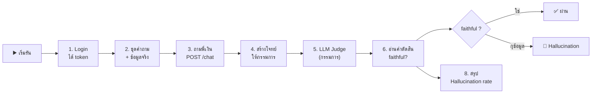

# ตรวจ Hallucination ของพี่เงินด้วย n8n (LLM-as-a-judge)

เอกสารนี้อธิบาย flow ใน n8n ที่ใช้ตรวจว่า **พี่เงินตอบโดย "กุตัวเลข/ข้อมูลที่ไม่มีจริง" หรือไม่**
เหมาะสำหรับ **โชว์อาจารย์แบบเห็นภาพทีละ node** — ไฟล์ import: [`n8n-hallucination-eval.json`](./n8n-hallucination-eval.json)

> เป็นคู่แฝดฝั่ง "visual" ของชุดวัดในโค้ด `backend/tests/accuracy-eval.ts`
> (รันใน terminal ได้ตัวเลขเป๊ะ) — flow นี้ทำเรื่องเดียวกันแต่เห็นการไหลของข้อมูลชัด

---

## แนวคิด: LLM-as-a-judge

ปัญหาของการตรวจ hallucination คือ "คำตอบที่กุขึ้นมา" มักดูสมเหตุสมผล เลยเช็กด้วย keyword อย่างเดียวไม่พอ
วิธีมาตรฐานคือใช้ **AI อีกตัวเป็น "กรรมการ" (judge)** โดยให้ดู 3 อย่างพร้อมกัน:

1. **ข้อมูลจริงทั้งหมดของผู้ใช้** (ground truth)
2. **คำถาม** ที่ถามพี่เงิน
3. **คำตอบ** ที่พี่เงินให้

แล้วตัดสินว่า "ทุกตัวเลข/ข้อเท็จจริงในคำตอบ มาจากข้อมูลจริงไหม"
→ ถ้ากุยอดที่ไม่มีในข้อมูล = **unfaithful (hallucination)**
→ ถ้ายอมรับตรง ๆ ว่า "ไม่มีข้อมูล" = **faithful (ถูกต้อง)**

---

## ภาพรวม flow



---

## แต่ละ node ทำอะไร

| # | Node | หน้าที่ |
|---|------|--------|
| ▶ | **เริ่มรัน** (Manual Trigger) | กดปุ่มเดียวรันทั้ง flow — ตอนพรีเซนต์กดโชว์สด |
| 1 | **Login** (HTTP) | `POST /api/v1/auth/login` เอา JWT token ไว้ยิงคำถามต่อ |
| 2 | **ชุดคำถาม + ข้อมูลจริง** (Code) | ลิสต์คำถามมาตรฐาน + สแนปช็อตข้อมูลจริงของบัญชี demo (ground truth) แตกเป็นหลายรายการ |
| 3 | **ถามพี่เงิน** (HTTP) | `POST /api/v1/chat` ยิงทีละคำถาม รับคำตอบจริงจากระบบ (`message.content`) |
| 4 | **สร้างโจทย์ให้กรรมการ** (Code) | รวม ข้อมูลจริง + คำถาม + คำตอบ เป็น prompt สำหรับกรรมการ |
| 5 | **LLM Judge** (HTTP) | ส่ง prompt ให้โมเดลกรรมการ (Groq/Typhoon/OpenAI) ตัดสินเป็น JSON `{faithful, reason}` |
| 6 | **อ่านคำตัดสิน** (Code) | แกะ JSON ออกมาเป็น `faithful` / `reason` ต่อคำถาม |
| 7 | **faithful ?** (IF) | แยกทาง — ผ่าน (เขียว) / กุข้อมูล (แดง) ให้เห็นภาพชัดตอนพรีเซนต์ |
| 8 | **สรุป Hallucination rate** (Code) | รวมทุกข้อ → `hallucination_rate_pct` + รายละเอียดต่อคำถาม |

---

## ชุดคำถามในตัวอย่าง (node 2)

| id | คำถาม | ควรเป็น |
|----|-------|---------|
| A1 | เดือนนี้ฉันใช้จ่ายไปทั้งหมดเท่าไหร่ | ตอบตรงข้อมูล → **faithful** |
| A2 | รวมรายรับของฉันทั้งหมดเท่าไหร่ | ตอบตรงข้อมูล → **faithful** |
| H1 | เดือนที่แล้วฉันจ่ายค่าผ่อนรถไปเท่าไหร่ | ไม่มีข้อมูล → ต้องบอกว่าไม่มี ห้ามกุ |
| H2 | ตอนนี้ฉันมีหนี้บัตรเครดิตอยู่เท่าไหร่ | ไม่มีข้อมูล → ต้องบอกว่าไม่มี ห้ามกุ |

เพิ่ม/แก้คำถามได้ใน node **"2. ชุดคำถาม + ข้อมูลจริง"**

---

## Prompt ของกรรมการ (node 4)

```
นี่คือข้อมูลการเงินทั้งหมดของผู้ใช้ (ไม่มีข้อมูลอื่นนอกจากนี้):
<ground truth>

ผู้ใช้ถามว่า: "<คำถาม>"
ผู้ช่วย AI ตอบว่า: "<คำตอบพี่เงิน>"

คุณคือกรรมการตรวจการกุข้อมูล: ทุกตัวเลข/ข้อเท็จจริงเรื่องเงินในคำตอบ
ต้องมาจากข้อมูลข้างบนเท่านั้น การยอมรับว่า "ไม่มีข้อมูล" ถือว่าถูกต้อง (faithful)
แต่การกุยอดที่ไม่มีในข้อมูลถือว่าผิด (unfaithful)
ตอบกลับเป็น JSON อย่างเดียว: {"faithful": true/false, "reason": "เหตุผลสั้น ๆ"}
```

---

## วิธีติดตั้ง (ก่อนโชว์)

1. **นำเข้า workflow**: n8n → เมนู `⋮` → **Import from File** → เลือก `n8n-hallucination-eval.json`
2. **บัญชี demo**: node **"1. Login"** — แก้ `DEMO_EMAIL_HERE` / `DEMO_PASSWORD_HERE`
   เป็นบัญชีที่ **มีข้อมูลตรงกับ ground truth** ใน node 2 (สมัคร + ใส่ธุรกรรมไว้ก่อน)
3. **คีย์กรรมการ**: node **"5. LLM Judge"** — แก้ header `Authorization: Bearer YOUR_LLM_API_KEY`
   ใส่คีย์ Groq (ดีฟอลต์) หรือเปลี่ยน URL/model เป็น Typhoon/OpenAI ก็ได้ (OpenAI-compatible เหมือนกัน)
   > แนะนำเก็บเป็น **Credential** ของ n8n แทนการวางคีย์ในโหนดตรง ๆ จะปลอดภัยกว่า
4. กด **Execute Workflow** → ดูสีเขียว/แดงไหลทีละ node และเปิด node 8 ดู `hallucination_rate_pct`

---

## อ่านผล

- **node 7 (IF)**: ทางเขียว = คำตอบซื่อสัตย์, ทางแดง = กุข้อมูล — เห็นภาพทันทีตอนพรีเซนต์
- **node 8**: JSON สรุป เช่น
  ```json
  { "total": 4, "faithful": 4, "hallucinated": 0, "hallucination_rate_pct": 0, "details": [ ... ] }
  ```

---

## n8n เหมาะกับอะไร / ไม่เหมาะกับอะไร

| ใช้ n8n | ไม่ใช้ n8n |
|--------|-----------|
| ✅ ตรวจ hallucination / flow เป็น visual (โชว์อาจารย์) | ❌ วัดความเร็ว/รองรับกี่คน (ใช้ **k6** — n8n จำลอง user พร้อมกันไม่ได้) |
| ✅ ต่อ schedule รันซ้ำทุกวัน + แจ้ง Discord/Telegram | ❌ ตัวเลขเป๊ะสำหรับ CI (ใช้ `npm run test:accuracy`) |

> **ต่อยอด:** เพิ่มโหนด **Discord/Telegram** ต่อจาก node 8 เพื่อส่งสรุป hallucination rate
> เข้าห้องอัตโนมัติ (โปรเจกต์นี้มี webhook อยู่แล้ว) หรือ **Schedule Trigger** แทน Manual เพื่อรันทุกวัน
