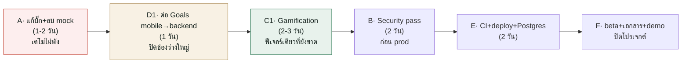

# 📋 งานที่เหลือ — พี่เงิน (AI Finance Coach)

> อัปเดต **6 ส.ค. 2569** · จากการอ่านโค้ดจริงทุกไฟล์ + เทียบแผน sprint

## 🎉 เพิ่งปิดได้ (เซสชัน 6 ส.ค. 69)
- ✅ **A1 · ลบข้อมูลปลอมทั้งหมด** (demo prefill, goal ปลอม, Fanta Inazuma, mock Gmail, demo seed) — compile ผ่าน 0 error
- ✅ **D2 · FCM push จริง** — firebase-admin v14 + service account · เทส foreground/background/**heads-up+เสียง** บน Android ผ่าน · `NOTIF_CRON=on`
- ✅ **Auth · Google + Facebook login ใช้ได้จริง** (แก้ oauth_client/SHA-1/audience + ตั้ง FB app)
- ✅ **C2 · budget_duration** เขียนใหม่เป็นปฏิทินจริง
- ✅ **แก้ build Android** (AGP9/Kotlin/compileSdk เข้ากับ flutter_facebook_auth) + ลบ duplicate backend tree + จับ Groq key leak

> **หมายเหตุ:** `SPRINT_STATUS.md` (23 มิ.ย.) และ `tasks/PLAN_Dome_Next.md` (4 ก.ค.) **ล้าสมัยแล้ว** — งานหลายอย่างที่เอกสารนั้นบอกว่า "เหลือทำ" ทำเสร็จไปแล้ว เอกสารนี้คือสถานะจริง ณ ปัจจุบัน
>
> รายละเอียดเชิงลึก: [`ARCHITECTURE.md`](ARCHITECTURE.md) (ทะเบียนความเสี่ยง R-1…R-18) · [`CODE_MAP.md`](CODE_MAP.md) (ไฟล์ไหนทำอะไร)

---

## ✅ สถานะจริงตอนนี้ (แก้ความเข้าใจจากเอกสารเก่า)

| ฟีเจอร์ | Backend | Mobile | หมายเหตุ |
|---|:--:|:--:|---|
| Auth (email + Google + Facebook) | ✅ | ✅ | ✅ **login ทั้ง 3 ใช้ได้จริงแล้ว** · ⚠️ R-2 (email_verified) ยังเปิด (ดู B) |
| Transaction + สแกนสลิป (Typhoon OCR) | ✅ | ✅ | |
| Budget + สถานะงบ | ✅ | ✅ | ⚠️ "งบรวม" นับผิด (ดู A) |
| Dashboard + กราฟ | — | ✅ | |
| แชทพี่เงิน (multi-LLM + OCR + เสียง) | ✅ | ✅ | |
| **Goals + AI แผนออม** | ✅ | ⚠️ | **mobile ยังไม่ต่อ backend — เก็บ Hive ล้วน (ดู D1)** |
| **Recommendations** | ✅ | ⚠️ | backend เสร็จ, ต้องเช็คว่า mobile ผูกการ์ดครบ |
| **Subscriptions + Gmail import** | ✅ | ✅ | ✅ ลบ mock Gmail แล้ว เหลือ OAuth 2.0 จริง |
| **Notifications + FCM** | ✅ | ✅ | ✅ FCM push + heads-up ใช้ได้จริง · ⚠️ push ซ้ำยังไม่แก้ (A3) |
| **Predictions (FastAPI + Prophet)** | ✅ | ✅ | ⚠️ สูตรพยากรณ์ผิด (ดู A) |
| **Export ไฟล์ (8 ฟอร์แมต)** | ✅ | ✅ | |
| **Gamification (streak/badge/level)** | ❌ | ❌ | **ยังไม่เริ่ม** — schema `Achievement` มีแต่ไม่มี route (ดู C1) |

**สรุป:** Sprint 5 และส่วนใหญ่ของ Sprint 6 (ยกเว้น gamification + beta) **สร้างเสร็จแล้ว** งานที่เหลือจริงคือ (A) แก้บั๊ก/ลบ mock ก่อนเดโม → (B) ความปลอดภัย → (C) ฟีเจอร์ที่ยังขาด → (D) การเชื่อมต่อที่ค้าง → (E) DevOps → (F) เอกสาร/ส่งงาน

---

## 🔴 A. ต้องแก้ก่อนเดโม/ส่งงาน — บั๊กที่เห็นชัด + ของปลอม

งานพวกนี้ทำให้ **เดโมพัง หรือแสดงตัวเลขผิดต่อหน้ากรรมการ** ควรทำก่อนอื่น

### A1 · ลบข้อมูล demo/mock — ✅ **เสร็จหมดแล้ว (6 ส.ค. 69)**
- [x] `login_screen.dart` — ลบ prefill `demo@bestimove.ai` / `demo1234` → ช่องว่าง
- [x] `goals_provider.dart` — ลบ goal ปลอม 3 อัน → empty state
- [x] `dashboard`/`goals`/`budget_list`/`financial_dashboard` — ลบ fallback `'Fanta Inazuma'` / streak 20 → `''`/`0`
- [x] `subscriptions_screen.dart` — ลบ mock Gmail flow (Netflix/Spotify ปลอม + dead code 3 คลาส) → เหลือ OAuth 2.0 จริง
- [x] `forgot_password_screen.dart` — ลบ email ปลอม `fantanaja@gmail.com`
- [x] `prisma/seed.ts` — ลบ sample transactions ปลอม (เก็บ demo user ไว้ล็อกอิน)

### A2 · บั๊กตัวเลขผิด (กระทบความน่าเชื่อถือของแอปการเงิน)
- [ ] `ai/predictions/app.py:76-77,174` — **สูตรพยากรณ์หารด้วยจำนวน *รายการ* แทนจำนวน *วัน*** → พยากรณ์ผิดเป็นเท่าตัว, เงินเดือน 25k กลายเป็นรายได้วันละ 25k
- [x] `backend/src/modules/transactions/parser.ts` — ✅ fallback `'Food'` → `OtherExpense`/`OtherIncome` แล้ว + เขียน keyword ครบ 32 หมวด
- [ ] **"งบรวม" (categoryId=null) นับผิด 4 ที่** — `budgets.routes.ts:91`, `triggers.ts:20`, `context_builder.ts:49`, `export.service.ts:108` (แก้เป็น `...(b.categoryId ? { categoryId } : {})`)
- [ ] `backend/src/modules/chat/chat.routes.ts:30-34` — `GET /chat` เรียงจากเก่าสุด → ผู้ใช้เกิน 100 ข้อความเห็นแต่ข้อความแรก ๆ (แก้เป็น `desc` + reverse)
- [ ] `mobile/lib/features/predictions/predictions_screen.dart:228` — แกน Y ตรึงที่ 0 → ยอดติดลบ (เคสที่ควรเตือน) ถูกตัดหาย

### A3 · UX พังที่ผู้ใช้เจอแน่ ๆ
- [ ] `mobile/lib/core/api/api_client.dart:52` — **`receiveTimeout: 10s` ทำให้แชท/OCR ล้มเป็นปกติ** (เพิ่มเป็น 60s) ← แก้บรรทัดเดียว กระทบมากสุด
- [ ] `mobile/lib/features/predictions/predictions_screen.dart:135-139` — pull-to-refresh เป็นฟังก์ชันว่าง หมุนแล้วไม่ทำอะไร
- [ ] `mobile/lib/app/router.dart:32,37` — onboarding เด้งใหม่ทุกครั้งที่เปิดแอป (ไม่ persist `onboardingDoneProvider`)
- [ ] `backend/src/modules/notifications/create.ts:29` — push ซ้ำเรื่องเดิมทุก 6 ชม. + ทุกครั้งที่บันทึกรายการ (ย้าย `sendPush` ให้ยิงเฉพาะตอนสร้างใหม่จริง)
- [ ] `backend/src/modules/subscriptions/reminders.ts` — **ไม่มีใครเลื่อน `nextBilling`** → subscription เตือนได้แค่รอบเดียวตลอดชีพ (ต้องมี job เลื่อน +1 เดือน/ปี)
- [ ] `mobile/lib/features/subscriptions/subscriptions_screen.dart:354` — แก้ subscription ฿99.50 → เขียนทับเป็น ฿100

---

## 🔒 B. ความปลอดภัย (Sprint 7 — ต้องทำก่อนขึ้น production จริง)

> ตรงกับแผน "Sprint 7 — Hardening" · รายละเอียดเต็มใน `ARCHITECTURE.md` §13

- [ ] **R-1** `lib/auth.ts:28` — `requireAuth` รับ JWT อะไรก็ได้ที่มี `sub` → export token (`dt` ใน URL) และ gmail `state` token ใช้เป็น session token ได้ · แก้: เช็ค `purpose` + แยก secret
- [ ] **R-2** `oauth.service.ts:42,53,77` — Google access token ไม่เช็ค `aud`, Facebook ไม่เช็ค app, ผูกบัญชีด้วยอีเมลโดยไม่เช็ค `email_verified` → ล็อกอินเป็นคนอื่นได้
- [ ] **R-3** `env.ts:11` — `JWT_SECRET` มี default สาธารณะ → ให้ throw เมื่อ `NODE_ENV=production`
- [ ] **R-6** `integrations.routes.ts:15` — Reflected XSS (`?error=` ยัดเข้า HTML ไม่ escape)
- [ ] **AI safety (ตามแผน)** — ตัด PII ก่อนส่ง LLM (มี `context_builder` ที่ไม่มี PII แล้ว แต่ OCR text ยังหลุดเข้า prompt ได้), กัน prompt injection ผ่าน OCR
- [ ] `transactions.routes.ts:102` — `console.log(req.body)` = log ข้อมูลการเงินผู้ใช้ลง production
- [ ] 🔑 **rotate Typhoon API key** (เคยโผล่ใน log ระหว่าง dev — ตามที่ SPRINT_STATUS ระบุ) + เช็ค `ai/.env` ว่าไม่เคย commit หลุด
- [ ] biometric lock (ตามแผน Sprint 7)

---

## 🟡 C. ฟีเจอร์ที่ยังไม่ทำตามแผน

### C1 · Gamification / Achievements (Sprint 6 — ยังไม่เริ่มเลย)
- [ ] Backend: service คำนวณ streak / badge / XP / level (schema `Achievement` + `User.streak/level` มีแล้ว แต่**ไม่มี route ใช้เลย**)
- [ ] `GET /api/v1/achievements` · `GET /api/v1/gamification/status`
- [ ] Mobile: feed UI (streak "🔥 12 วัน", badge, level, weekly challenge)

### C2 · หน้าจอที่ยังเป็น stub
- [ ] `mobile/lib/features/auth/forgot_password_screen.dart` — **stub ทั้ง 3 ขั้น** ไม่ส่ง OTP จริง กด next ทั้งที่ว่างก็ผ่าน password กับ confirm ไม่เคยเทียบกัน · ต้องต่อ backend (ยังไม่มี endpoint reset password ด้วย)
- [x] `mobile/lib/features/budgets/budget_duration_screen.dart` — ✅ เขียนใหม่เป็นปฏิทินจริง (เดือน/ปีปัจจุบัน เปลี่ยนเดือนได้ เลือกวันได้) แทน mock เมษา 2026
- [ ] `mobile/lib/features/menu/menu_screen.dart` — การ์ด "ตั้งค่า" + "ความเป็นส่วนตัว" เป็น stub `_soon()`

### C3 · PDPA (Sprint 7)
- [ ] consent ตอนสมัคร + หน้า privacy policy
- [ ] ลบบัญชี (schema เป็น `onDelete: Cascade` แล้ว — เหลือ endpoint + ปุ่ม)
- [ ] export ข้อมูลส่วนตัว (มี `/export` อยู่แล้ว — เชื่อมให้ผู้ใช้กดได้)

---

## 🔌 D. การเชื่อมต่อที่ยังค้าง

### D1 · Mobile Goals → Backend ⭐ (ช่องว่างใหญ่สุด)
- [ ] **ฟีเจอร์ goals ฝั่ง mobile ไม่ต่อ backend เลย** — `goals_provider.dart` เก็บ Hive ล้วน ทั้งที่ backend มี `/api/v1/goals` + AI แผนออม (`/goals/:id/plan`) ครบแล้ว
- [ ] ผูก list/create/edit/deposit เข้า API จริง + ผูกการ์ด "พี่เงินแนะนำ" กับ `POST /goals/:id/plan`
- [ ] ลบ `_initialGoals()` (goal ปลอม 3 อัน) ออกตอนต่อ backend สำเร็จ

### D2 · FCM push จริง — ✅ **เสร็จแล้ว (6 ส.ค. 69)**
- [x] `npm i firebase-admin` (v14.2.0 modular API)
- [x] Firebase project `phee-ngern` → service account JSON → env `FIREBASE_SERVICE_ACCOUNT`
- [x] ทดสอบ push บน Android — foreground/background/**heads-up + เสียง** ผ่าน (ยืนยันด้วย adb)
- [x] `NOTIF_CRON=on`
- [ ] iOS — ต้องตั้ง APNs เพิ่ม (ยังไม่ทำ)

### D3 · เก็บกวาด mobile-backend ที่ผูกไม่ครบ
- [ ] `budget_list_screen.dart:78` — เช็ค empty ผิด list → ถ้า `/budgets/status` ล่มจะเห็นหน้าว่างเงียบ ๆ
- [ ] `budget_edit_screen.dart` — ช่องชื่อแก้ได้แต่ไม่เคยถูกส่งไป backend
- [ ] ไม่มี 401 interceptor (`api_client.dart:60`) → token หมดอายุแล้วผู้ใช้ติดค้างแทนที่จะถูกพาไป login

---

## ⚙️ E. Infra / DevOps

- [ ] **CI (GitHub Actions)** — `flutter analyze` = 0 error + backend `npm run build`/typecheck ผ่าน (ค้างตั้งแต่ Sprint 1)
- [ ] **Deploy staging** (Railway / Render)
- [ ] **ย้าย SQLite → PostgreSQL** — เปลี่ยน `provider` ใน `schema.prisma:10` + ใช้ `prisma migrate` แทน `db push` (ตอนนี้ไม่มีโฟลเดอร์ `migrations/`)
- [ ] **ลง Redis จริง** (ตอนนี้ in-memory fallback — จะ scale เกิน 1 instance ไม่ได้ เพราะ export cache หาย, ดู R-15)
- [ ] `ai/requirements.txt` — **ขาด `fastapi`, `uvicorn`, `pandas`, `numpy`, `prophet`** → ติดตั้งตาม README แล้วรัน predictions ไม่ได้ (ต้องเพิ่ม)
- [ ] `.env.example` — เพิ่มตัวแปรที่โค้ดอ่านตรงจาก `process.env` (`REDIS_URL`, `NOTIF_CRON`, `PREDICTION_API_URL`, `FIREBASE_SERVICE_ACCOUNT`)
- [ ] `/health` ตอบ 200 แม้ DB ตาย (R-9) → LB จะส่ง traffic เข้า pod เสีย

---

## 📦 F. เอกสาร / ส่งงาน (Sprint 8)

- [ ] Beta release 30+ users + analytics/crash logging (Sprint 6)
- [ ] Store assets + release build (TestFlight / Play Store)
- [ ] production deploy + monitoring
- [ ] demo video + รายงานฉบับสมบูรณ์
- [ ] เอกสาร SE ใน `docs/se/` — ตรวจว่า RTM/test plan ตรงกับโค้ดปัจจุบัน (RTM มี path ที่ชี้ไฟล์ผิด เช่น `python_service/prophet_predict.py` ที่จริงคือ `ai/predictions/app.py`)
- [ ] เขียน test — ตอนนี้ **ยังไม่มี test เลยทั้ง backend และ mobile** (ต่างจาก `testing.md` ที่ตั้งเป้า 80%)

---

## 🧹 G. เก็บกวาดโค้ด (ทำเมื่อว่าง — ไม่บล็อกส่งงาน)

### ลบได้ทันที (dead code)
- [ ] `mobile/lib/features/onboarding/welcome_screen.dart` (ไฟล์เขียนเองว่าไม่ใช้แล้ว)
- [ ] `chat_repository.dart` → `ocrImage()`, `transactions_repository.dart` → `analyzeText()`/`listBudgetStatuses()`/`DashboardPeriod`, `subscriptions_repository.dart` → `importFromGmail()` (ไม่มีใครเรียก)
- [ ] `pubspec.yaml` → `image_cropper` (ไม่ถูก import)
- [ ] `ai/coach/` + `ai/ocr_spike/` — spike เก่าที่ถูกแทนด้วย TypeScript แล้ว (เก็บไว้อ้างอิงได้ แต่ควรใส่ README บอกว่าเป็นของเก่า)

### แยกไฟล์ที่ยาวเกิน
- [ ] `chat_screen.dart` (1,123) · `dashboard_screen.dart` (1,026) · `financial_dashboard_screen.dart` (1,020) · `edit_goal_screen.dart` (849) · `export.service.ts` (675)

### หนี้เชิงโครงสร้าง
- [ ] ย้าย `chat/coach.ts`+`context_builder.ts`+`persona.ts` ขึ้นเป็น `lib/ai/` (เพราะ `goals/plan.ts` และ `recommendations/` ข้ามมาเรียก — ตำแหน่งไม่ตรงบทบาท)
- [ ] ตั้งชื่อไฟล์ mobile ให้สม่ำเสมอ (repository/service/provider/controller ใช้ปนกัน)

---

## 🎯 ลำดับแนะนำ (ถ้าเวลาจำกัด)

**Quick wins วันนี้ (แก้บรรทัดเดียว–ไม่กี่บรรทัด กระทบสูง):**
1. `api_client.dart:52` — `receiveTimeout` 10s → 60s
2. `parser.ts:149` — fallback `'Food'` → `'Other'`
3. `login_screen.dart:24-25` — ลบรหัสผ่าน demo
4. `predictions_screen.dart:228` — เอา `.clamp(0.0, ...)` ออก
5. `app.py:174` — หารด้วยจำนวนวัน ไม่ใช่จำนวนรายการ

---

## 📊 นับงานคร่าว ๆ

| หมวด | จำนวน | ความเร่งด่วน |
|---|:--:|---|
| A · บั๊ก + ลบ mock | 17 | 🔴 ก่อนเดโม |
| B · ความปลอดภัย | 8 | 🔴 ก่อน prod |
| C · ฟีเจอร์ที่ขาด | 8 | 🟡 gamification สำคัญสุด |
| D · เชื่อมต่อที่ค้าง | 8 | 🟡 D1 สำคัญสุด |
| E · DevOps | 7 | 🟡 |
| F · เอกสาร/ส่งงาน | 7 | 🟢 ช่วงท้าย |
| G · เก็บกวาด | — | 🟢 เมื่อว่าง |

---

*สร้างจากการอ่านโค้ดจริงทุกไฟล์ · อ้างอิงไฟล์:บรรทัด ตรวจย้อนได้ · แก้เอกสารนี้เมื่อปิดงานแต่ละข้อ*
