# Database ERD — AI Finance Coach ("พี่เงิน")

> แผนภาพนี้ generate จาก `backend/prisma/schema.prisma` (source of truth)
> แก้ไข: พิมพ์แก้ในบล็อก ```mermaid ด้านล่างได้เลย GitHub / VS Code (Markdown Preview Mermaid) จะ render ให้อัตโนมัติ
>
> 💡 หมายเหตุเรื่องเงิน: ทุกฟิลด์จำนวนเงิน (`amount`, `target`, `current`, `monthlyIncome`) เก็บเป็น **สตางค์** (Int, 1 บาท = 100) เพื่อกัน floating-point error

```mermaid
erDiagram
    User ||--o{ Transaction  : "has"
    User ||--o{ Budget       : "has"
    User ||--o{ Goal         : "has"
    User ||--o{ ChatMessage  : "has"
    User ||--o{ Achievement  : "has"
    User ||--o{ Notification : "has"
    User ||--o{ Subscription : "has"

    Category |o--o{ Transaction : "categorizes"
    Category |o--o{ Budget      : "limits"

    User {
        string   id            PK "cuid"
        string   email         UK
        string   phone         "nullable"
        string   passwordHash  "nullable · OAuth ไม่มีรหัสผ่าน"
        string   provider      "local | google | facebook"
        string   providerId    "nullable · sub/id จาก provider"
        string   avatarUrl     "nullable"
        string   displayName   "nullable"
        int      monthlyIncome "satang"
        int      level
        int      streak
        string   deviceToken   "nullable · FCM token"
        datetime createdAt
        datetime updatedAt
    }

    Category {
        string   id        PK "cuid"
        string   name      "English key · unique(name,type)"
        string   nameTh    "ชื่อไทยที่แสดงผล"
        string   icon      "emoji"
        string   color     "hex"
        string   type      "income | expense"
        boolean  isDefault
        datetime createdAt
    }

    Transaction {
        string   id         PK "cuid"
        string   userId     FK
        string   type       "income | expense"
        int      amount     "satang"
        string   note       "nullable"
        string   source     "manual | ocr | sms"
        string   categoryId FK "nullable"
        datetime occurredAt "index(userId, occurredAt)"
        datetime createdAt
        datetime updatedAt
    }

    Budget {
        string   id         PK "cuid"
        string   userId     FK
        string   categoryId FK "nullable"
        int      amount     "satang / period"
        string   period     "monthly | weekly"
        datetime createdAt
    }

    Goal {
        string   id        PK "cuid"
        string   userId    FK
        string   name
        int      target    "satang"
        int      current   "satang"
        datetime deadline  "nullable"
        datetime createdAt
    }

    ChatMessage {
        string   id        PK "cuid"
        string   userId    FK
        string   role      "user | assistant"
        string   content
        string   context   "nullable · JSON snapshot"
        datetime createdAt
    }

    Achievement {
        string   id         PK "cuid"
        string   userId     FK
        string   type
        datetime unlockedAt
    }

    Notification {
        string   id        PK "cuid"
        string   userId    FK
        string   type      "budget_near | budget_over | daily_summary | goal | subscription"
        string   title
        string   body
        boolean  read
        string   data      "nullable · JSON meta"
        datetime createdAt "index(userId, createdAt)"
    }

    Subscription {
        string   id          PK "cuid"
        string   userId      FK
        string   name
        int      amount      "satang / cycle"
        string   cycle       "monthly | yearly"
        datetime nextBilling "index(userId, nextBilling)"
        string   logo        "nullable · emoji หรือ url"
        datetime createdAt
        datetime updatedAt
    }
```



## ความสัมพันธ์ (Relationships)

| จาก | ถึง | ชนิด | หมายเหตุ |
|-----|-----|------|----------|
| User | Transaction | 1 : N | `onDelete: Cascade` |
| User | Budget | 1 : N | `onDelete: Cascade` |
| User | Goal | 1 : N | `onDelete: Cascade` |
| User | ChatMessage | 1 : N | `onDelete: Cascade` |
| User | Achievement | 1 : N | `onDelete: Cascade` |
| User | Notification | 1 : N | `onDelete: Cascade` |
| User | Subscription | 1 : N | `onDelete: Cascade` |
| Category | Transaction | 0..1 : N | `categoryId` เป็น nullable |
| Category | Budget | 0..1 : N | `categoryId` เป็น nullable |

## สัญลักษณ์ (Legend)

- **PK** = Primary Key (ทุกตารางใช้ `cuid()`)
- **FK** = Foreign Key
- **UK** = Unique Key
- `||--o{` = one-to-many (ฝั่งซ้ายบังคับมี 1)
- `|o--o{` = zero/one-to-many (FK เป็น nullable)
