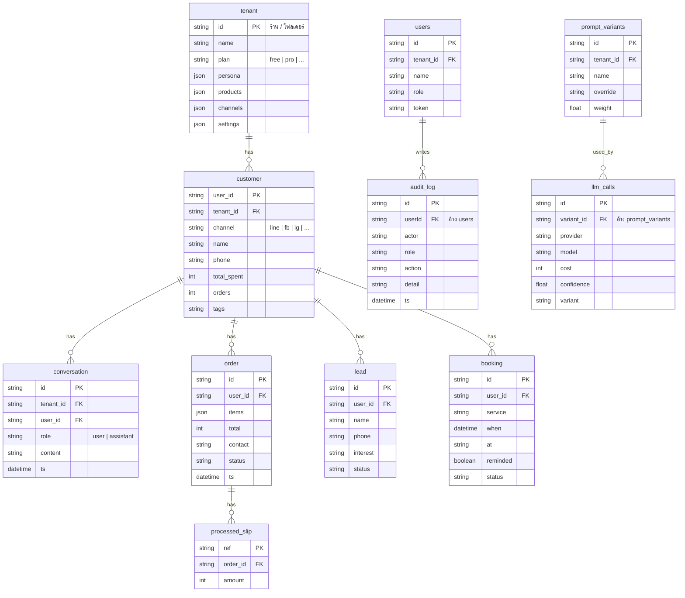

# ERD — Multi-tenant AI Assistant (ดีไซน์ใหม่)

> ⚠️ **นี่คือ schema ดีไซน์ใหม่ (target)** ยังไม่ตรงกับ `backend/prisma/schema.prisma` ปัจจุบัน (ดู [database-erd.md](database-erd.md) สำหรับของจริงตอนนี้)
> ไฟล์นี้ทำจากแผนภาพที่ตกลงกันไว้ เพื่อส่งต่อให้แตงกวาลงมือทำ
>
> แก้ไข: พิมพ์แก้ในบล็อก ```mermaid ได้เลย · GitHub / VS Code (Markdown Preview Mermaid) render ให้อัตโนมัติ
> ชนิดข้อมูล/PK/FK บางส่วนเป็นการ **เดาจากชื่อฟิลด์** — ปรับได้ตามจริง



## ความสัมพันธ์ที่วาดไว้ (ตามแผนภาพ)

| จาก | ถึง | ชนิด |
|-----|-----|------|
| tenant | customer | 1 : N |
| customer | conversation | 1 : N |
| customer | order | 1 : N |
| customer | lead | 1 : N |
| customer | booking | 1 : N |
| users | audit_log | 1 : N |
| order | processed_slip | 1 : N |
| prompt_variants | llm_calls | 1 : N |

## หมายเหตุ (ยังไม่ได้วาดเส้น แต่มี field อ้างถึง)

- `users.tenant_id`, `conversation.tenant_id`, `prompt_variants.tenant_id` → อ้าง `tenant` (implied FK)
- ถ้าจะให้ครบ อาจเพิ่มเส้น `tenant 1:N users`, `tenant 1:N prompt_variants` ได้
