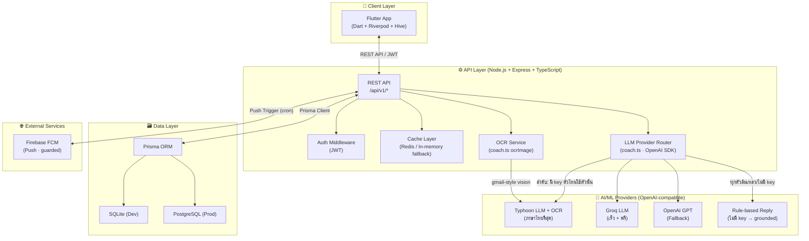
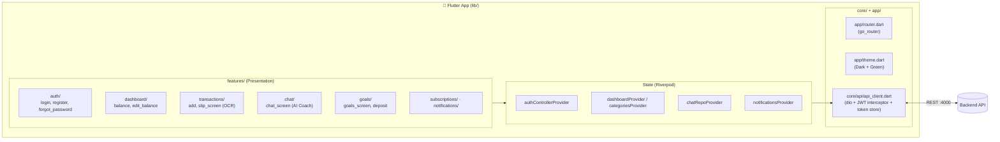
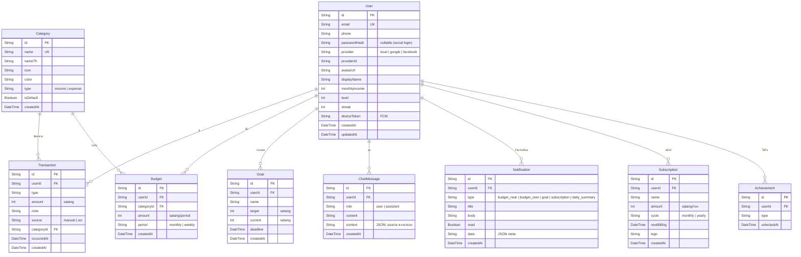
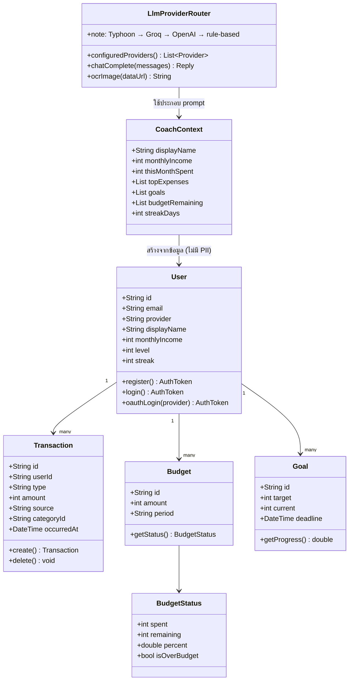
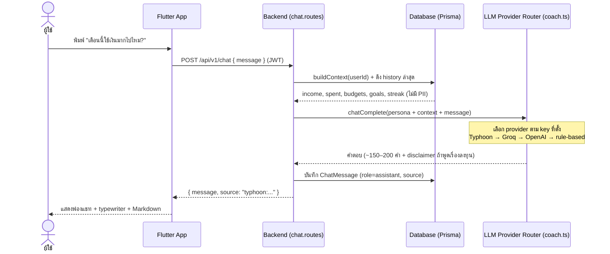
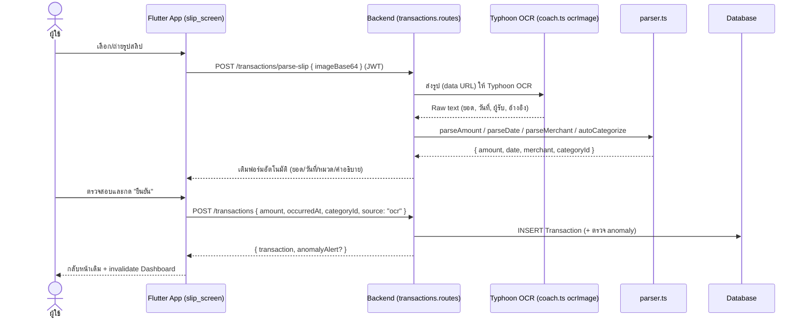
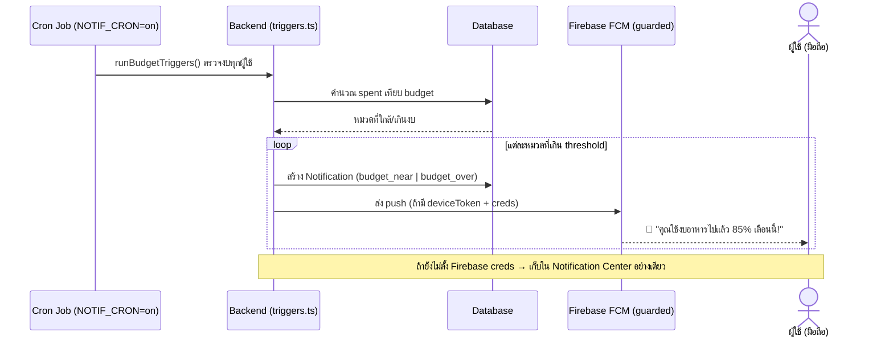

# SE-4 Design & Implementation Diagrams

> อ้างอิงจาก implementation จริงใน repo (backend แบบ modular `src/modules/*`, Flutter `lib/features/*`)

## 1. System Architecture Diagram

ภาพรวมสถาปัตยกรรมของระบบ AI Finance Coach "พี่เงิน" แสดงการสื่อสารระหว่าง Layer ทั้งหมด



> **หมายเหตุ:** ไม่ได้ใช้ LangChain — การเลือก provider ทำเองใน `backend/src/modules/chat/coach.ts` (`configuredProviders()` + `chatComplete()`) ผ่าน OpenAI SDK ที่ตั้ง `baseURL` ต่างกันต่อ provider · OCR สลิปเป็น **server-side** ด้วย Typhoon OCR (ไม่ใช่ ML Kit บนเครื่อง)

---

## 2. Component Diagram

แสดง Component ทั้งหมดของ Mobile App ฝั่ง Flutter



---

## 3. ER Diagram (จาก Prisma Schema จริง — 9 models)



---

## 4. UML Class Diagram (Core Domain)



---

## 5. Sequence Diagrams

### 5.1 แชทกับ AI Coach "พี่เงิน" (Context-Aware Chat)



### 5.2 สแกนสลิป (Server-side Typhoon OCR) → บันทึก Transaction



### 5.3 ตรวจสอบงบประมาณและแจ้งเตือน



---

## 6. Wireframe — หน้าจอสำคัญ

### 6.1 หน้า Goals (เป้าหมายการออม) — ทำแล้ว

```
┌─────────────────────────────┐
│ 🎯 เป้าหมายของฉัน           │
├─────────────────────────────┤
│  ✈️ เที่ยวญี่ปุ่น          │
│  [██████████░░░░] 45%       │
│  22,500 / 50,000 บาท        │
│  ครบกำหนด: ธ.ค. 2569        │
├─────────────────────────────┤
│  🏠 ดาวน์คอนโด             │
│  [████░░░░░░░░░░] 25%       │
│  75,000 / 300,000 บาท       │
│  ครบกำหนด: มิ.ย. 2570       │
├─────────────────────────────┤
│     [+ สร้างเป้าหมายใหม่]  │
└─────────────────────────────┘
```

### 6.2 หน้า Gamification (Streak & Badge) — Sprint 6 (ยังไม่ทำ)

```
┌─────────────────────────────┐
│ 🔥 สตรีคปัจจุบัน: 12 วัน  │
│                             │
│  🥉 นักออมหน้าใหม่    ✅   │
│  🥈 บันทึกสม่ำเสมอ    ✅   │
│  🥇 นักวางแผน         🔒   │
│  💎 ปรมาจารย์การเงิน   🔒   │
│                             │
│ 📅 ชาเลนจ์สัปดาห์นี้       │
│  "บันทึกรายจ่าย 7 วันติด" │
│  [████████░░] 4/7 วัน      │
└─────────────────────────────┘
```
