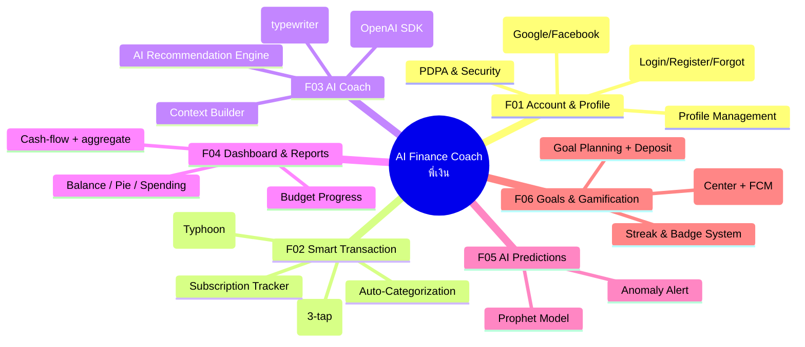

# Feature / Function / Task Master List + WBS

## 6 ฟีเจอร์หลัก (อ้างอิงตาม P01)
1. บัญชี/โปรไฟล์ (Account/Profile)
2. บันทึกรายรับ-จ่ายด้วย OCR/Manual (Smart Transaction)
3. AI Coach "พี่เงิน"
4. Dashboard / รายงาน (Dashboard & Reports)
5. คาดการณ์ด้วย AI (AI Predictions)
6. เป้าหมาย และ Gamification (Goals & Gamification)

## Work Breakdown Structure (WBS)
*หมายเหตุ: mermaid ไม่มีชนิด `wbs` จึงใช้ `mindmap` แทน*

## Task Master List
*สถานะอัปเดตจากงานจริงใน repo (✅ Done / 🏃 Doing / ⏳ Todo)*

| ID | Feature -> Component -> Function/Task | Owner | Status | Sprint |
|---|---|---|---|---|
| **F01** | **Account & Profile (บัญชี/โปรไฟล์)** | | | |
| C01.1 | Auth UI (Login/Register/Forgot Password) | ต้า | ✅ Done | 1 |
| C01.2 | Auth API (JWT Authentication) | โดม | ✅ Done | 1 |
| C01.3 | Social Login (Google/Facebook OAuth) | โดม | ✅ Done | 5 |
| C01.4 | PDPA (Consent, Export, ลบบัญชี) | โดม | ⏳ Todo | 7 |
| C01.5 | Biometric Lock (Face ID / Fingerprint) | ต้า | ⏳ Todo | 7 |
| **F02** | **Smart Transaction (บันทึกรายรับ-จ่าย)** | | | |
| C02.1 | Manual Add Transaction UI | ต้า | ✅ Done | 1 |
| C02.2 | Transaction CRUD API | โดม | ✅ Done | 1 |
| C02.3 | สแกนสลิป UI (SlipScreen) | โดม | ✅ Done | 5 |
| C02.4 | OCR + Post-processing (Typhoon + parser.ts) | โดม | ✅ Done | 5 |
| C02.5 | Auto-categorize (autoCategorize) | โดม | ✅ Done | 2 |
| C02.6 | Subscription Tracker + Gmail import | โดม | ✅ Done | 5 |
| **F03** | **AI Coach "พี่เงิน"** | | | |
| C03.1 | Chat UI (Message List, typewriter) | ต้า/โดม | ✅ Done | 4 |
| C03.2 | Context Builder (ดึงข้อมูลให้ AI) | โดม | ✅ Done | 4 |
| C03.3 | LLM Provider Router (OpenAI SDK: Typhoon→Groq→OpenAI→rule-based) | โดม | ✅ Done | 4 |
| C03.4 | AI Recommendation Engine | โดม | ✅ Done | 4 |
| **F04** | **Dashboard & Reports (รายงาน)** | | | |
| C04.1 | Dashboard UI (Balance, Pie, งบประมาณ) | ต้า | ✅ Done | 3 |
| C04.2 | Budget Engine API & Cash-flow (aggregate) | โดม | ✅ Done | 3 |
| **F05** | **AI Predictions (คาดการณ์ AI)** | | | |
| C05.1 | Prediction UI (แสดงผลทำนาย) | ต้า | ⏳ Todo | 6 |
| C05.2 | Prophet Model Deployment (FastAPI) | โดม | ⏳ Todo | 6 |
| **F06** | **Goals & Gamification (เป้าหมาย)** | | | |
| C06.1 | Goal Creation UI & Progress + Deposit | ต้า | ✅ Done | 5 |
| C06.2 | Goals CRUD API + AI Savings Plan | โดม | ✅ Done | 5 |
| C06.3 | Notifications (Center + triggers) | โดม | ✅ Done | 5 |
| C06.4 | FCM Push (ของจริง) | โดม | 🏃 Doing (รอ Firebase creds) | 5-6 |
| C06.5 | Gamification UI (Streak, Badge) | ต้า | ⏳ Todo | 6 |
| C06.6 | Achievements Engine API | โดม | ⏳ Todo | 6 |
