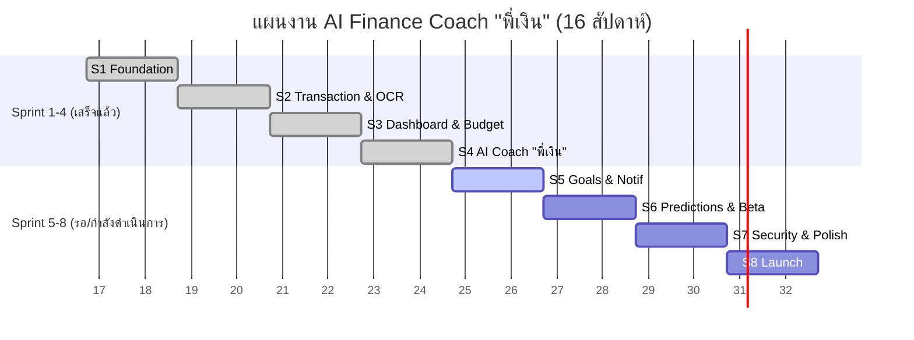

# Project Plan & Monitoring

## 1. Scope & Development Process
- **Process:** Scrum (2-week sprint)
- **เหตุผลที่ใช้:** เนื่องจากโปรเจกต์นี้มีความท้าทายและเป็นนวัตกรรมใหม่ (มีการใช้ AI, OCR และระบบทำนายผล) ซึ่งมีความไม่แน่นอนสูง การแบ่งการทำงานเป็น Sprint ย่อยรอบละ 2 สัปดาห์ (ทั้งหมด 8 Sprint = 16 สัปดาห์) จะช่วยให้ทีมสามารถประเมินผล พัฒนา และปรับเปลี่ยนฟีเจอร์ได้อย่างรวดเร็ว (Fail fast, learn fast) ทำให้มั่นใจได้ว่าทุกๆ 2 สัปดาห์จะมีซอฟต์แวร์ที่สามารถนำไป Demo และทดสอบกับผู้ใช้งานได้จริง

## 2. Gantt Chart (Plan vs. Actual)
*อ้างอิงจากแผน P01 ระยะเวลา 16 สัปดาห์ โดยอัปเดตสถานะความสำเร็จจากความเป็นจริง*

## 3. Sprint Board & Burndown Chart
**ตัวอย่างการประเมิน Point ประจำ Sprint:** 
สมมติว่า Sprint 5 มี Story Points รวมทั้งหมด **40 Points** ในระยะเวลา 10 วันทำงาน 
**ความเร็วที่คาดหวัง (Ideal Velocity):** เผางานเฉลี่ย **4 Points** ต่อวันทำงาน

| วันใน Sprint | แต้มที่เหลือ (แผน) | แต้มที่เหลือ (ความจริง) |
|-------------|---------------------|----------------------|
| Day 1       | 40                  | 40                   |
| Day 3       | 32                  | 35                   |
| Day 5       | 24                  | 20                   |
| Day 8       | 12                  | 15                   |
| Day 10      | 0                   | 0                    |

## 4. Progress Tracking (Sprint 1-8)
*อัปเดตสถานะการส่งมอบงานจากเอกสาร `SPRINT_STATUS.md`*

| Sprint | เป้าหมายหลักของ Sprint | สถานะภาพรวม | % Done |
|--------|----------------------|------------|--------|
| **Sprint 1** | Foundation + Walking Skeleton | ✅ Done | 100% |
| **Sprint 2** | Transaction Core + OCR | ✅ Done | 100% |
| **Sprint 3** | Smart Dashboard + Budget | ✅ Done | 100% |
| **Sprint 4** | AI Coach "พี่เงิน" | ✅ Done (แถมโบนัส) | 100% |
| **Sprint 5** | Goals + Notifications (+ Social Login/OCR สลิป/Subscription เป็นโบนัส) | 🏃 Doing | ~90% |
| **Sprint 6** | Predictions + Gamification + Beta | ⏳ Todo | 0% |
| **Sprint 7** | Hardening (Security / PDPA / Polish) | ⏳ Todo | 0% |
| **Sprint 8** | Launch + สรุปโปรเจกต์ | ⏳ Todo | 0% |
