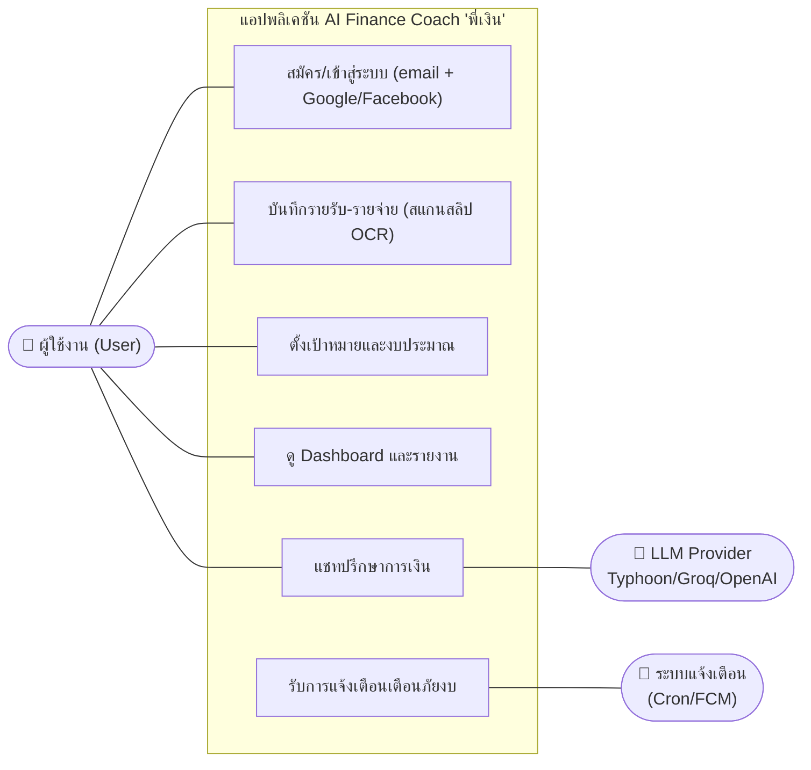

# Requirement Engineering

## 1. User Stories & Acceptance Criteria
*ครอบคลุม 4 กลุ่มผู้ใช้งานเป้าหมายจาก P01 รวมถึงผลวิเคราะห์จากแบบสอบถามผู้ใช้งานจริง*

**กลุ่มที่ 1: นักศึกษาที่เป็นผู้เริ่มวางแผนการเงิน**
- **User Story (REQ-001):** As a นักศึกษา, I want to สแกนสลิปโอนเงินผ่านมือถือ so that ระบบสามารถบันทึกรายจ่ายและจัดหมวดหมู่อัตโนมัติโดยที่ฉันไม่ต้องพิมพ์เอง
- **Acceptance Criteria:**
  - ระบบ (backend Typhoon OCR) ดึงจำนวนเงิน วันที่ และชื่อผู้รับ/บันทึกช่วยจำจากรูปสลิปได้ถูกต้อง
  - ผู้ใช้ตรวจสอบและกดยืนยัน (Confirm) ก่อนที่ระบบจะบันทึกข้อมูล
  - ระบบจัดหมวดหมู่ (เช่น อาหาร, ช้อปปิ้ง) จากชื่อร้าน/คีย์เวิร์ดได้อัตโนมัติ (มี fallback ให้กรอกเองถ้าอ่านไม่ได้)

**กลุ่มที่ 2: พนักงานที่มีเป้าหมายออม / ปลดหนี้**
- **User Story (REQ-002):** As a พนักงานประจำ, I want to กำหนดเป้าหมายการออมและงบรายเดือน so that ฉันสามารถติดตามความคืบหน้าและควบคุมไม่ให้ใช้จ่ายเกินงบได้
- **Acceptance Criteria:**
  - ผู้ใช้สร้างเป้าหมาย (ชื่อ, จำนวนเงิน, กำหนดเวลา) และฝากเงินเข้าเป้าได้
  - ระบบแสดงแถบความคืบหน้า (Progress Bar) และเปรียบเทียบเงินที่ใช้กับงบประมาณ
  - ระบบสร้างการแจ้งเตือนเมื่อการใช้จ่ายเข้าใกล้/เกินงบ (budget_near / budget_over) แสดงใน Notification Center

**กลุ่มที่ 3: ฟรีแลนซ์และผู้มีรายได้ไม่แน่นอน**
- **User Story (REQ-003):** As a ฟรีแลนซ์, I want to ดู Dashboard สรุปรายรับ-รายจ่ายที่ปรับช่วงเวลาได้ so that ฉันสามารถวิเคราะห์กระแสเงินสดในแต่ละช่วงได้
- **Acceptance Criteria:**
  - Dashboard สรุปยอดคงเหลือ/รายรับ/รายจ่าย + แยกตามหมวดหมู่
  - สลับมุมมองช่วงเวลา (รายวัน / สัปดาห์ / เดือน) ผ่าน `GET /transactions/aggregate`
  - แสดงผลเร็ว (มี Cache layer: Redis / in-memory fallback) และดูเข้าใจง่าย

**กลุ่มที่ 4: ผู้ที่ต้องการจัดการหนี้บัตรเครดิต / สินเชื่อ**
- **User Story (REQ-004):** As a ผู้มีหนี้บัตรเครดิต, I want to ปรึกษา AI Coach "พี่เงิน" so that ฉันได้รับคำแนะนำที่เป็นรูปธรรมตามสภาพการเงินจริงของฉัน
- **Acceptance Criteria:**
  - พิมพ์แชทถาม AI Coach ด้วยภาษาไทยธรรมชาติได้ตลอด 24 ชั่วโมง
  - AI ดึงข้อมูล Transaction/งบ/เป้าหมายของผู้ใช้ (Context Injection — ไม่มี PII) มาประกอบการตอบ
  - AI ไม่แนะนำการลงทุนรายตัว และมี Disclaimer เสมอเมื่อพูดเรื่องลงทุน (กำกับผ่าน system prompt/persona)

## 2. Use Case Diagram
*แสดงความสัมพันธ์ระหว่างระบบและ Actor (User, LLM Provider, Notification System)*
*หมายเหตุ: mermaid ไม่มี `usecaseDiagram` โดยตรง จึงจำลองด้วย flowchart*

## 3. Requirement Traceability Matrix (RTM)
*ตารางสอบย้อนกลับ: เชื่อมโยง Requirement → Design → โค้ดจริง → Test เพื่อยืนยันว่าถูกพัฒนาและทดสอบครบ*

| Req ID | User Story | Design / Screen | Code File (จริงใน repo) | Test Case |
|--------|-----------|-----------------|-------------------------|-----------|
| **REQ-001** | บันทึกรายจ่ายอัตโนมัติจากสลิป (OCR) | Sequence 5.2 / Screen: `SlipScreen (เลือกสลิป)` | `mobile/lib/features/transactions/slip_screen.dart` · `backend/src/modules/transactions/transactions.routes.ts` (`/parse-slip`) · `backend/src/modules/transactions/parser.ts` · `backend/src/modules/chat/coach.ts` (`ocrImage`) | TC-01, TC-02 |
| **REQ-002** | ตั้งเป้าหมาย/งบ + แจ้งเตือน | ER Diagram / Screen: `goals_screen` | `mobile/lib/features/goals/goals_screen.dart` · `backend/src/modules/goals/goals.routes.ts` · `backend/src/modules/notifications/triggers.ts` | TC-05 |
| **REQ-003** | Dashboard สรุปยอด ปรับช่วงเวลาได้ | Component Diagram / Screen: `dashboard_screen` | `mobile/lib/features/dashboard/dashboard_screen.dart` · `backend/src/modules/transactions/transactions.routes.ts` (`/aggregate`) | TC-06 |
| **REQ-004** | แชทปรึกษา AI Coach (Context-Aware) | Sequence 5.1 / Screen: `chat_screen` | `mobile/lib/features/chat/chat_screen.dart` · `backend/src/modules/chat/{chat.routes.ts, coach.ts, context_builder.ts, persona.ts}` | TC-03, TC-04 |
