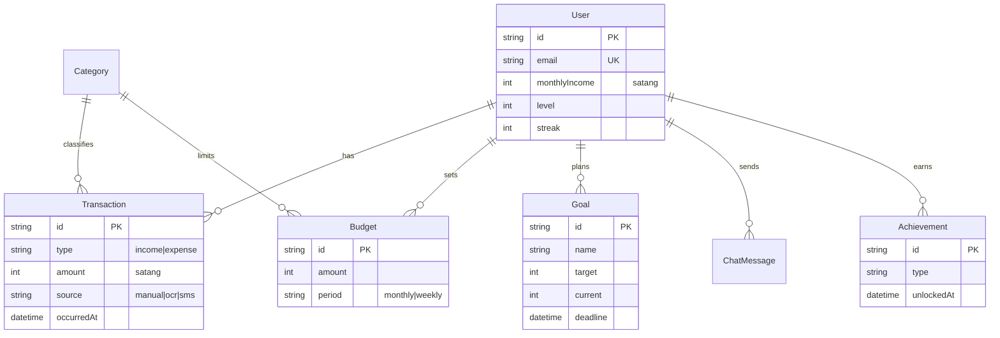

## 🧩 TASK — แตงกวา (Software Engineer)

> **โฟกัสรอบนี้:** เป็นเจ้าของ **กระบวนการวิศวกรรมซอฟต์แวร์** ของทั้งโปรเจกต์ — วางแผน/มอนิเตอร์, วิเคราะห์ความต้องการ, ออกแบบด้วย diagram, และวางแผน+ทำการทดสอบ ส่งมอบเป็นเอกสารใน `docs/se/` (markdown) เพื่อให้ ต้า+โดม (Developer) implement ได้ตรง และทีมป้องกันโครงงานได้

> ⚠️ รอบนี้บทบาทเปลี่ยนจาก *System Analyst* → *Software Engineer* งานเดิม (screen spec/nav map) ยังใช้ได้และถือเป็นส่วนหนึ่งของ **Requirement + Design** ด้านล่าง

---

### 🎯 ทำไมงานนี้ = คะแนนของแตงกวา (rubric: Software Eng, เต็ม 70)

งานทุกชิ้นถูกออกแบบให้ตรงช่องให้คะแนน **1:1** — ทำครบ = เก็บครบ

**CLO5 (55) — ประยุกต์ใช้ความรู้/ทักษะดิจิทัล**
| # | เกณฑ์ในใบให้คะแนน | คะแนน | งานที่ตอบ |
|---|---|:--:|---|
| 1 | จำนวน Component/Feature/Function/**Task** | 15 | **SE-1** feature list + WBS |
| 2 | การวางแผนโครงงาน (Project Planning & Monitoring) | 10 | **SE-2** project plan + board + burndown |
| 3 | กระบวนการวิศวกรรมความต้องการ (Requirement Engineering) | 6 | **SE-3** user story + use case + RTM |
| 4 | การออกแบบและพัฒนา (Design — Conceptual/Component/UML/ER/Wireframe) | 10 | **SE-4** diagram set |
| 5 | การทดสอบความถูกต้อง (Testing — Prototype/System/UAT) | 8 | **SE-5** test plan + report |
| 6 | ความเข้าใจในงานที่ทำ (ตอบคำถามกรรมการ) | 6 | **SE-6** system overview + defense prep |

**CLO6 (15) — ประยุกต์ใช้ความรู้อย่างสร้างสรรค์เพื่อพัฒนานวัตกรรม**
| # | เกณฑ์ | คะแนน | งานที่ตอบ |
|---|---|:--:|---|
| 7 | ขอบเขตโครงงานน่าสนใจ/แปลกใหม่ | 5 | **SE-6** innovation.md |
| 8 | Component/Feature ใช้แนวคิดสร้างสรรค์/แปลกใหม่ | 5 | **SE-6** (Typhoon Thai LLM, multimodal coach) |
| 9 | ใช้เทคนิค/วิธีการมาดัดแปลง/ประยุกต์เหมาะสม | 5 | **SE-6** (LangChain + ML Kit OCR + context injection) |

> 💡 **จุดสำคัญ:** ช่อง #1 (15 คะแนน) แตงกวาเป็นเจ้าของ "บัญชีฟีเจอร์" ของทีม — และตัวเลขนี้ยัง **ป้อนให้ rubric ของ ต้า+โดม** (ที่นับ Screen/Component อัตโนมัติ) ด้วย → เอกสารเดียวได้ 3 เด้ง

---

## งานย่อย

### SE-1 · Feature / Function / Task Master List + WBS ⭐ทำก่อน
เจ้าของ "บัญชีฟีเจอร์" ของทั้งระบบ — ให้ครบและนับได้
- ลิสต์ทุก **Feature → Component → Function/Task** พร้อม ID (เช่น `F03 AI Coach` → `C03.1 Chat UI`, `C03.2 Context Builder`, `Fn03.2.1 buildContext()`)
- ระบุ **เจ้าของ (ต้า/โดม)**, สถานะ (done/doing/todo), sprint
- ทำ **WBS** (แตกงานเป็นชั้น) — ใช้ Mermaid ก็ได้
- ส่ง: `docs/se/feature_list.md`

**ตั้งต้นจากของจริงในโปรเจกต์** (6 ฟีเจอร์หลักตาม P01): บัญชี/โปรไฟล์ · บันทึกรายรับ-จ่าย(OCR/SMS/manual) · AI Coach "พี่เงิน" · Dashboard/รายงาน · คาดการณ์ AI · เป้าหมาย/gamification

### SE-2 · Project Plan + Monitoring
ตอบช่อง "วางแผนโครงงาน" — ต้องเห็น **คน / งาน / ขนาดงาน / ความก้าวหน้า**
- **Scope + Development Process** ที่ใช้ (Scrum 2-week sprint) — อธิบายว่าทำไม
- **Gantt** อัปเดตจาก P01 (16 สัปดาห์) → เทียบแผน vs จริง
- **Sprint board + Burndown** (เหลือ point เท่าไรต่อวัน) — ภาพหรือตารางก็ได้
- **Progress tracking**: ตาราง sprint 1–8 %done (ดึงจาก [SPRINT_STATUS.md](../SPRINT_STATUS.md))
- ส่ง: `docs/se/project_plan.md`

### SE-3 · Requirement Engineering (ตรวจสอบย้อนกลับได้)
ตอบช่อง "กระบวนการวิศวกรรมความต้องการ" — จุดตายคือ **traceability**
- **User Stories** รูปแบบ `As a <ผู้ใช้> I want <...> so that <...>` + acceptance criteria (ครอบ 4 กลุ่มผู้ใช้ใน P01)
- **Use Case Diagram** (actor: User, AI Coach/Typhoon, ระบบแจ้งเตือน) — Mermaid
- **Requirement Traceability Matrix (RTM)**: `Requirement ID → User Story → Design (diagram) → Code file → Test case` — ตารางเดียวโยงครบเส้นทาง
- ส่ง: `docs/se/requirements.md`

### SE-4 · Design & Implementation Diagrams
ตอบช่อง "การออกแบบและพัฒนา" — ยิ่งหลายมุมมองยิ่งได้คะแนน ทำครบชุด:
- **Conceptual / System Architecture** — Mobile(Flutter) ↔ Backend(Node/Express) ↔ DB(Postgres/SQLite) ↔ AI(Typhoon/LangChain) ↔ FCM
- **Component Diagram** — โมดูล backend (auth/transactions/budgets/chat/goals/notifications) + layer มือถือ
- **UML Class Diagram** — จาก Prisma schema (7 ตาราง: User, Category, Transaction, Budget, Goal, ChatMessage, Achievement)
- **Sequence Diagram** — อย่างน้อย 3 flow: (1) ถามพี่เงิน→context injection→LLM, (2) สแกนสลิป OCR→ยืนยัน→save, (3) ตั้งเป้า→AI แผนออม
- **ER Diagram** — ความสัมพันธ์ตาราง (ดู starter ด้านล่าง)
- **Wireframe** — ทุกหน้าใหม่ (Onboarding, Goals, Budget Edit, History, Notif Center) — ต่อยอด screen spec เดิม
- ส่ง: `docs/se/design/` (แยกไฟล์ต่อ diagram)

📐 ER starter (Mermaid — เปิดใช้ได้เลย, ตรงกับ schema จริง)

### SE-5 · Test Plan + Test Cases + UAT + Report
ตอบช่อง "การทดสอบความถูกต้อง" — ต้อง **แสดงผลการทดสอบได้**
- **Test Plan**: ขอบเขต, ระดับ (unit/integration/system/UAT), เกณฑ์ผ่าน
- **Test Cases** ตาราง: `TC-ID | ฟีเจอร์ | ขั้นตอน | ข้อมูลนำเข้า | ผลที่คาด | ผลจริง | ผ่าน/ไม่ผ่าน`
- **Prototype Testing**: ทดสอบ flow บน demo build (คลิกจริง)
- **System Testing**: ทดสอบ end-to-end ต่อ backend จริง (login→ตั้งเป้า→แจ้งเตือน)
- **UAT**: สคริปต์ให้ตัวแทนผู้ใช้ (นักศึกษา/พนักงาน) ลอง + แบบเก็บความพึงพอใจ (ผูกกับ Beta ใน Sprint 6)
- **Test Report**: สรุปผ่าน/ไม่ผ่าน + bug ที่เจอ + สถานะแก้
- ส่ง: `docs/se/test_plan.md` (+ `docs/se/test_report.md`)
- 🔁 **Test cases = เช็คลิสต์ review PR ของ ต้า+โดม** (ปิด loop คุณภาพ)

### SE-6 · System Understanding + Innovation (CLO6)
ตอบช่อง "ความเข้าใจในงาน" (6) + CLO6 ทั้ง 3 ช่อง (15)
- **System Overview 1 หน้า** + **Q&A เตรียมป้องกัน** (กรรมการถามอะไรได้บ้าง + คำตอบ): ทำไมเก็บเงินเป็นสตางค์? ตัด PII ก่อนส่ง LLM ยังไง? SMS ทำไมเป็น best-effort?
- **Innovation writeup** (อย่างน้อย 3 ตาม P01): **Typhoon** (Thai LLM) · **LangChain** (เชื่อม LLM+ข้อมูล) · **Google ML Kit OCR** (on-device) · bonus: multimodal coach (เสียง/รูป) → เขียนว่า *ใหม่/สร้างสรรค์อย่างไร* และ *ประยุกต์กับระบบยังไง*
- ส่ง: `docs/se/innovation.md`

### SE-7 · Build & CI/CD Evidence — Test Environment Matrix 🆕
> เสริมช่อง **Testing (SE-5, 8)** + **Project Planning & Monitoring (SE-2, 10)** — เปลี่ยน "การ build/run จริงทุก platform" (ทำแล้ว 3 ก.ค.) ให้เป็น **หลักฐานทดสอบระบบบนสภาพแวดล้อมจริง**
- **Test Environment Matrix** — ตาราง `platform × build × run × หมายเหตุ`: Android (emulator `pixel_ai`) ✅✅ · Windows `.exe` ✅✅ · Web (Edge) ✅✅ · iOS/macOS = ผ่าน **Codemagic CI** (build บน Windows ไม่ได้)
- **Build/Run evidence** — คำสั่ง + ผล (`flutter build apk` / `build windows` / `run -d edge`), artifact (`app-debug.apk`, `ai_finance_coach.exe`), **screenshot แอปรันบน emulator** (หน้า Login ต่อ backend `10.0.2.2:4000` จริง)
- **CI pipeline doc** — อธิบาย `codemagic.yaml` (4 workflow: android/ios/macos/web), unsigned artifact + ขั้นถัดไป (code signing) → ตอบช่อง CI/monitoring
- **Toolchain matrix** — เวอร์ชันที่ทีมต้องใช้ตรงกัน: Flutter 3.44.4 · Dart 3.12.2 · Android SDK 35 + JDK 21 (JBR) · VS BuildTools 2022 + ATL · Developer Mode ON (กันปัญหา "รันบนเครื่องฉันได้")
- ส่ง: `docs/se/test_environment.md` · 🔁 เป็นส่วน "System/Integration Testing" ของ SE-5 test report

---

## 🤝 ทำงานคู่กับ ต้า + โดม
- **SE-1/SE-3 เป็น input ของ dev** → ส่งภายใน 2–3 วันแรกให้ทีมมี field/flow อ้างอิง
- **SE-4 (ER/Sequence/Wireframe)** ทำคู่ขนานตอน dev เริ่ม coding — อย่าให้บล็อก
- เจอ **API ขาด** (เช่น `/goals`, `/notifications` ยังไม่มี) → แจ้งโดมทันที + ร่าง field ที่ต้องการ
- **SE-5** ใช้รีวิว PR ทุกใบ = คุณเป็น QA gate ของทีม

## 🔄 การส่งงาน
- แตก branch: `feature/taengkwa-se-<งาน>` (เช่น `feature/taengkwa-se-requirements`)
- เอกสารอยู่ใน `docs/se/` → เปิด PR → merge เข้า `main`
- 📖 ขั้นตอน Git ละเอียด: [../GIT_WORKFLOW_GUIDE.md](../GIT_WORKFLOW_GUIDE.md)

## ✅ Definition of Done
- [ ] `docs/se/` ครบ **7 งาน** (feature_list, project_plan, requirements+RTM, design/*, test_plan+report, innovation, **test_environment**)
- [ ] RTM โยงครบ requirement → design → code → test (traceable)
- [ ] Diagram อย่างน้อย: Architecture, Component, Class, 3×Sequence, ER, Wireframe หน้าใหม่
- [ ] Test cases ครอบทุกหน้าใหม่ + ใช้รีวิว PR ของ ต้า/โดม จริง
- [ ] SE-7: `test_environment.md` มี matrix build/run ครบ 5 platform + หลักฐาน (artifact/screenshot) + doc `codemagic.yaml`
